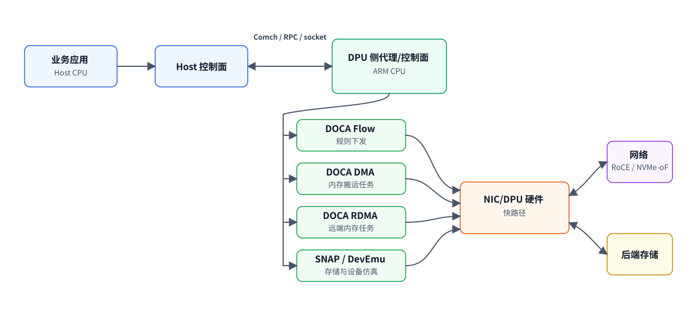

# DOCA 学习系列总览

> 目标：从完全不了解 DOCA 开始，逐步掌握它的应用场景、平台组成、底层原理、核心 API 编程模型，以及 DOCA 内部如何使用 Flow、Comch、DMA、RDMA、SNAP、遥测等能力构建 DPU/SuperNIC 基础设施应用。

## 0. 官方资料基线

本系列参考并核对过以下 NVIDIA 官方文档入口：

| 主题 | 官方页面 |
|---|---|
| 总入口 | <https://docs.nvidia.com/doca/sdk/index.html> |
| Developer Quick Start | <https://docs.nvidia.com/doca/sdk/DOCA-Developer-Quick-Start-Guide/index.html> |
| DOCA Core | <https://docs.nvidia.com/doca/sdk/DOCA-Core/index.html> |
| DOCA Flow | <https://docs.nvidia.com/doca/sdk/DOCA-Flow/index.html> |
| DOCA Comch | <https://docs.nvidia.com/doca/sdk/DOCA-Comch/index.html> |
| DOCA DMA | <https://docs.nvidia.com/doca/sdk/DOCA-DMA/index.html> |
| DOCA RDMA | <https://docs.nvidia.com/doca/sdk/DOCA-RDMA/index.html> |
| Capabilities 工具 | <https://docs.nvidia.com/doca/sdk/DOCA-Capabilities-Print-Tool/index.html> |
| RoCE | <https://docs.nvidia.com/doca/sdk/RDMA-over-Converged-Ethernet/index.html> |

当前核对到的公开文档标题为 **DOCA Documentation v3.3.0**。后续实际开发时，请以你安装的 DOCA 版本、BlueField 固件、驱动与包内示例为准。

## 1. 先建立总图

DOCA 可以粗略理解为：

> CUDA 让 GPU 计算可编程；DOCA 让 BlueField DPU / SuperNIC 上的数据中心基础设施能力可编程。

它不是单个库，而是一组面向网络、存储、安全、遥测、内存搬运、RDMA、设备仿真和硬件卸载的 SDK、Runtime、服务、工具与参考应用。

最重要的认知：DOCA 不是“完全不用 CPU”。典型分工是：

| 部分 | 谁执行 | 说明 |
|---|---|---|
| 业务逻辑 | Host CPU | 数据库、存储服务、业务进程仍在 Host 上运行 |
| 控制面/编排 | Host、DPU ARM 或外部 Controller | 负责创建连接、下发规则、处理异常 |
| DPU 侧 agent | BlueField ARM CPU | 运行 DOCA app、服务、慢路径处理 |
| 网络 fast path | DPU/NIC 硬件 | match-action、转发、修改、计数、队列转发等 |
| DMA/RDMA/crypto/compress | 硬件引擎，视设备能力而定 | CPU 提交任务，硬件搬运/计算 |
| 异常/flow miss/admin | DPU ARM 或 Host CPU | 仍需要软件处理 |

## 2. 推荐学习顺序

> 下列数字表示阅读步骤；链接文件名开头的两位数字才是章节编号。

### 第一阶段：理解平台

1. [DOCA 是什么与应用场景](01-what-is-doca-and-use-cases.md)
2. [平台组成与运行环境](02-platform-components-and-environment.md)
3. [架构与卸载原理](03-architecture-and-offload-principles.md)

这一阶段的目标：搞清楚 Host、DPU、NIC 硬件、SDK、服务、参考应用之间的边界。

### 第二阶段：掌握通用编程模型

4. [DOCA Core 编程模型](04-doca-core-programming-model.md)
5. [Capabilities 与能力探测](11-hands-on-quickstart-and-first-app.md#2-能力探测)

这一阶段的目标：理解为什么 DOCA 大量 API 都围绕 `doca_dev`、`doca_mmap`、`doca_buf`、`doca_ctx`、`doca_task`、`doca_pe` 展开。

### 第三阶段：分模块学习数据面能力

6. [DOCA Flow](05-doca-flow-network-datapath.md)
7. [DOCA Comch](06-doca-comch-control-channel.md)
8. [DOCA DMA](07-doca-dma-memory-movement.md)
9. [DOCA RDMA / RoCE](08-doca-rdma-and-roce.md)
10. [Storage / SNAP / NVMe / virtio](09-storage-snap-nvme-virtio.md)
11. [Security / Crypto / Telemetry / Ops](10-security-crypto-telemetry-ops.md)

这一阶段的目标：知道每个模块解决什么问题、在哪个 plane、谁执行、如何组合。

### 第四阶段：动手与综合设计

12. [Quick Start 与第一个参考应用](11-hands-on-quickstart-and-first-app.md)
13. [端到端综合设计](12-end-to-end-rdma-flow-storage-design.md)
14. [性能调优与开发排障手册](13-performance-tuning-and-troubleshooting.md)
15. [代码实验语言选择与项目布局](14-code-lab-language-and-layout.md)
16. [Lab 00：Hello DOCA Log（C）](15-lab-00-hello-log-c.md)
17. [Lab 01：Capabilities Python 环境探测](16-lab-01-caps-python.md)
18. [Lab 02：DMA Local Copy（C）](17-lab-02-dma-local-copy-c.md)
19. [Lab 03：Comch Host/DPU 控制通道（C）](18-lab-03-comch-host-dpu-c.md)
20. [Lab 04：RDMA Write/Read（C）](19-lab-04-rdma-write-read-c.md)
21. [Lab 05：Flow ACL + Counter（C）](20-lab-05-flow-acl-c.md)

这一阶段的目标：能在真实 BlueField/SuperNIC 环境中检查能力、跑通官方参考应用，设计 Host↔DPU↔Remote 的基础设施数据通路，明确后续代码实验的 C/Python/C++/Go/Rust 分工，并按 Lab 00-05 逐步完成从日志、环境探测、DMA、Comch、RDMA 到 Flow ACL 的实验路线。

### 第五阶段：近数据路径与 GPU 数据面

22. [DPA、FlexIO 与 DPACC 编程模型](21-doca-dpa-flexio-programming-model.md)
23. [GPUNetIO 与 GPU 直接处理网络包](22-doca-gpunetio-gpu-packet-processing.md)
24. [DOCA 技术术语表](98-technical-glossary.md)
25. [官方文档索引](99-official-reference-map.md)

这一阶段的目标：理解 DPA 的事件驱动近数据路径执行，以及 GPUNetIO 如何让 CUDA kernel 直接推进 Ethernet、RDMA 和 DMA 数据面。

## 3. 贯穿全系列的学习问题

阅读时始终问四个问题：

1. **这个能力属于哪个 plane？** 控制面、数据面、慢路径、快路径？
2. **谁执行？** Host CPU、DPU ARM、NIC/DPU 硬件、远端节点？
3. **数据怎么走？** Host 内存、DPU 内存、PCIe、网络、RDMA、后端存储？
4. **控制信息怎么走？** Comch、socket、RPC、RDMA CM、配置文件、service API？

## 4. 术语速记

| 术语 | 简明解释 |
|---|---|
| BlueField DPU | 带 ARM CPU、NIC、硬件加速能力的 NVIDIA 数据处理器 |
| SuperNIC | 面向 AI/云网络的 NVIDIA 高性能智能网卡产品线，DOCA 也是其软件框架之一 |
| DOCA Core | DOCA 通用对象、内存、任务、进度引擎、设备抽象 |
| DOCA Flow | 面向硬件转发管线的 match-action 网络数据面编程接口 |
| DOCA Comch | Host 与 DPU 之间的控制消息通道 |
| DOCA DMA | 用硬件 DMA 引擎在 DOCA buffer 之间搬运数据 |
| DOCA RDMA | 基于 RDMA/RoCE 的远端内存访问、send/recv/read/write 等任务 |
| RoCE | RDMA over Converged Ethernet，让 RDMA 跑在以太网上 |
| SNAP | DPU 侧存储虚拟化/设备仿真服务，可向 Host 暴露 NVMe/virtio 等设备 |
| PE | Progress Engine，DOCA 异步任务推进与完成处理机制 |

## 5. 文档维护约定

- 官方命令、路径、API 名称优先引用 NVIDIA 文档。
- 所有 PCI 地址都必须视为示例，实际环境用 `doca_caps`、`lspci`、`ibdev2netdev` 等命令确认。
- 不把 DOCA 说成完全开源项目；它是 NVIDIA vendor SDK/framework，公开文档与示例存在，但核心运行时/固件/服务按 NVIDIA EULA 与发行包为准。
- 不把硬件卸载理解成“无 CPU”；控制面、异常路径、任务提交、连接管理仍需要 CPU。
