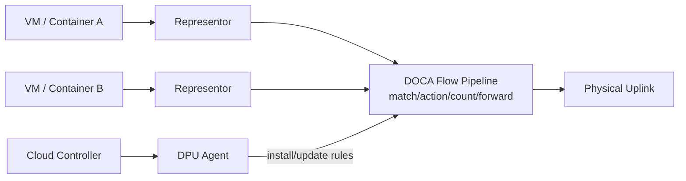

# 01. DOCA 是什么与应用场景

## 1. 一句话理解 DOCA

DOCA 是 NVIDIA 面向 BlueField DPU / SuperNIC 的数据中心基础设施软件框架。

如果说 CUDA 让 GPU 计算变成可编程资源，那么 DOCA 的目标是让网络、存储、安全、遥测、RDMA、DMA、设备仿真等基础设施能力变成可编程资源。

它通常服务于这类问题：

- Host CPU 被网络、安全、存储、虚拟化、遥测等基础设施任务消耗过多；
- 云平台希望把租户 workload 与基础设施控制面隔离；
- 网络/存储数据路径需要更低延迟、更高吞吐、更可控的硬件 offload；
- AI/HPC 集群需要高性能 RoCE/RDMA、GPU 直连网络、拥塞控制、遥测；
- 安全/零信任/隔离需求要求在 Host 外部执行策略检查或数据面处理。

## 2. DOCA 不是什么

先排除几个常见误解：

| 误解 | 更准确的说法 |
|---|---|
| DOCA 等于 DPDK | DOCA 可与 DPDK/SPDK/OVS 等生态结合，但 DOCA 是 NVIDIA DPU/SuperNIC 软件框架，覆盖范围更广 |
| DOCA 等于网卡驱动 | 它依赖驱动、固件和运行时，但提供更高层 SDK、服务、工具和参考应用 |
| DOCA 完全不需要 CPU | 控制面、任务提交、异常处理仍需要 Host CPU 或 DPU ARM CPU；硬件主要负责 fast path/offload |
| DOCA 是完整开源项目 | DOCA 是 NVIDIA vendor SDK/framework，示例和生态组件可能开放，但核心 SDK/runtime/firmware 不应简单等同于开源项目 |
| DOCA 只做网络 | 网络是核心场景之一，但它也覆盖 DMA、RDMA、storage/SNAP、security、crypto、telemetry、DPA、GPUNetIO 等 |

## 3. 典型应用场景

### 3.1 云网络与虚拟化数据面

在虚拟化或云平台中，Host 上可能运行多个 VM/container。基础设施层需要完成：

- vSwitch / 转发；
- ACL / 安全组；
- NAT / tunnel encap/decap；
- 计数与 telemetry；
- 多租户隔离；
- SR-IOV / representor 管理。

DOCA Flow 可以把大量 match-action 规则下发到 NIC/DPU 硬件，使常见包处理走硬件 fast path；DPU ARM 负责规则安装、慢路径和控制面。

### 3.2 安全隔离与服务插入

DPU 位于 Host 与网络之间，天然适合做基础设施安全边界：

- Host 外防火墙；
- 微隔离策略；
- 加密/解密；
- 流量镜像与检测；
- VM/进程可观测性；
- 安全 agent 隔离在 DPU，而不是和业务 workload 混跑在 Host。

相关 DOCA 能力包括 Flow、App Shield、AES-GCM、SHA、Telemetry 等。

### 3.3 存储虚拟化与 NVMe/virtio 设备仿真

DOCA SNAP / DevEmu 可在 DPU 侧向 Host 暴露标准设备，例如 NVMe、virtio-blk、virtio-fs。Host 看到的是标准 PCIe/NVMe/virtio 设备；DPU 侧把请求转发到本地 SPDK bdev、远端 NVMe-oF、对象存储适配层或自定义后端。

价值：

- Host 使用标准驱动，不需要业务感知 DPU 后端实现；
- DPU 侧可插入加密、压缩、QoS、telemetry、隔离策略；
- 远端存储访问可利用 RDMA/NVMe-oF。

### 3.4 RDMA 与高性能数据移动

在 AI/HPC/存储系统中，常见瓶颈是数据搬运：

- Host↔DPU 内存复制；
- 节点↔节点远端内存读写；
- GPU↔NIC 直接数据路径；
- 存储前端↔后端数据通路。

DOCA DMA 提供本地/跨端 DOCA buffer 的硬件 DMA copy；DOCA RDMA 提供基于 RDMA/RoCE 的 send/recv/read/write/atomic 等任务模型。

### 3.5 AI 集群网络与遥测

AI 训练集群对网络敏感：

- tail latency；
- congestion control；
- packet loss；
- RoCE 配置；
- GPU 直连网络；
- 大规模链路与队列 telemetry。

DOCA 生态中 GPUNetIO、DPA、PCC、Telemetry、Flow Inspector 等组件服务于这类场景。

## 4. DOCA 的价值边界

DOCA 最适合基础设施数据面/控制面问题，而不是普通业务 CRUD 逻辑。

适合：

- 大量重复、可规则化的 packet/flow 处理；
- 大吞吐低延迟数据移动；
- Host 外隔离的基础设施 agent；
- 存储/网络/安全设备虚拟化；
- 对硬件 offload 和 observability 有明确需求的系统。

不一定适合：

- 单机小规模、CPU 资源充足的普通应用；
- 业务逻辑频繁变化、难以抽象成数据面规则的场景；
- 没有 BlueField/SuperNIC/ConnectX 能力或无法控制网络环境的场景；
- 希望完全摆脱驱动/固件/硬件版本复杂性的项目。

## 技术细节补充：从场景反推模块

| 场景 | 关键技术名词 | DOCA 相关能力 | 需要确认的边界 |
|---|---|---|---|
| 云网络/安全组 | representor、eSwitch、ACL、tunnel、RSS、counter | DOCA Flow、Flow CT、Telemetry | 哪些 match/action 能硬件表达，哪些必须走慢路径 |
| Host 外安全隔离 | DPU agent、policy controller、App Shield、mirror、audit | Flow、App Shield、Telemetry、crypto | DPU 只能做基础设施边界，不替代应用自身鉴权 |
| 高性能存储 | NVMe controller、namespace、SQ/CQ、SPDK bdev、NVMe-oF | SNAP、DevEmu、DMA、RDMA | 后端一致性、flush、reservation 需要单独设计 |
| AI/HPC 网络 | RoCEv2、GID、QP/CQ、PFC、ECN、DCQCN、GPUDirect | RDMA、GPUNetIO、PCC、Telemetry | 网络交换机配置常比代码更决定稳定性 |
| 数据处理卸载 | AES-GCM、SHA、compress、erasure coding、task engine | AES-GCM、SHA、Compress、Erasure Coding | 只有足够大的批量/数据块才可能抵消提交开销 |

DOCA 的“应用场景”不要按产品宣传理解，而要按 **数据路径是否足够高频、规则化、可由硬件/专用引擎表达** 来判断。一个场景适不适合 DOCA，通常看三点：

1. **Host CPU 是否真的被基础设施任务占用**：如果 CPU 不是瓶颈，DPU 引入的复杂度可能不划算。
2. **控制面变化频率是否低于数据面**：如果每个包都要重新决策，Flow/RDMA/DMA 的 fast path 优势发挥不出来。
3. **目标硬件是否支持所需动作**：以 `doca_caps`、官方 support matrix、目标固件为准。

## 性能/调优视角

- 做 DOCA 方案设计前，先量化 Host CPU baseline：pps、Gbps、IOPS、p99 latency、CPU cycles/packet 或 cycles/IO。
- 优先卸载 **稳定、重复、吞吐高** 的路径，例如 ACL、固定转发、批量 DMA、RDMA 后端访问。
- 不要把低频管理操作强行硬件化；控制面应追求正确性、幂等性和可观测性。
- 对短小请求要警惕“offload 负收益”：任务提交、内存注册、队列同步可能超过 CPU 直接处理成本。
- 用端到端指标判断收益：Host CPU 降了但 DPU ARM 打满、p99 变差，也不是成功。

## 开发中常见问题

| 问题 | 原因 | 处理方式 |
|---|---|---|
| 以为 DOCA 能替代业务逻辑 | DOCA 主要面向基础设施数据面/控制面 | 把业务逻辑、策略控制、硬件 fast path 分层设计 |
| 以为 DPU 等于“无 CPU” | DPU ARM 仍执行 agent/慢路径 | 监控 DPU ARM CPU、内存、队列、日志 |
| 没有硬件也开始写复杂代码 | DOCA 能力强依赖设备/固件/模式 | 先拿到目标机器 `doca_caps` 输出 |
| 官方示例 PCI 地址照抄 | BDF 每台机器不同 | 用 `doca_caps --list-devs` 和 `--list-rep-devs` 查询 |
| 场景过早复杂化 | 多模块组合难排障 | 单模块最小闭环验证后再组合 |

## 5. 学完本章应该记住

1. DOCA 是面向 DPU/SuperNIC 的基础设施编程框架。
2. 核心价值是把网络、存储、安全、数据移动等基础设施能力从 Host CPU 迁移到 DPU ARM 和硬件 fast path。
3. DOCA 并不消灭 CPU；它重新划分 Host CPU、DPU ARM、硬件引擎的职责。
4. Flow、Comch、DMA、RDMA、SNAP 是理解 DOCA 的关键模块。
5. 后续学习要持续区分：控制面 vs 数据面，慢路径 vs 快路径，软件执行 vs 硬件卸载。

## 6. 下一步

继续阅读：[02. 平台组成与运行环境](02-platform-components-and-environment.md)。
