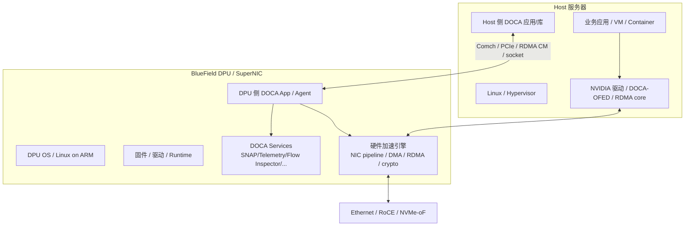

# 02. 平台组成与运行环境

## 1. 总体组成

DOCA 不是一个单独二进制或单个库。实际系统通常由以下部分组成：



## 2. 硬件层

### 2.1 BlueField DPU

BlueField DPU 通常包含：

- ARM CPU cores：运行 DPU OS、DOCA app、基础设施 agent；
- NIC datapath：高性能收发包、队列、representor、SR-IOV、硬件 steering；
- PCIe endpoint/switch 相关能力：与 Host 互联；
- 加速引擎：视型号/固件支持 DMA、RDMA、crypto、compression 等；
- 管理接口：用于安装、升级、配置、诊断。

### 2.2 SuperNIC / ConnectX

NVIDIA 的 SuperNIC / ConnectX 产品也可能暴露 DOCA 支持能力，尤其在网络、RDMA、GPUNetIO、telemetry 等方向。具体能力必须用官方 compatibility matrix 和 `doca_caps` 查询，不能只凭产品名猜。

## 3. 软件层

### 3.1 DOCA SDK

DOCA SDK 提供 C API、库、头文件、示例、参考应用、工具。常见安装路径在官方文档示例中位于：

```bash
/opt/mellanox/doca/
```

实际路径取决于 DOCA 版本、发行包和 OS。

### 3.2 DOCA-OFED / 驱动 / 固件

DOCA 应用依赖底层驱动、固件、RDMA/网络栈。实际开发前必须确认：

- DPU/网卡固件版本；
- Host 与 DPU OS 版本；
- DOCA SDK 版本；
- DOCA-OFED / MLNX_OFED 迁移状态；
- RDMA core、ibverbs、RoCE 配置；
- 设备模式：DPU mode、NIC mode、embedded mode 等。

### 3.3 DOCA Services

除 SDK 外，DOCA 还有服务/工具形态，例如：

- SNAP / SNAP-4：存储虚拟化与设备仿真服务；
- Telemetry Service / Exporter：遥测采集与导出；
- Flow Inspector：Flow 管线可视化/导出；
- Management Service：管理与能力服务；
- HBN、Virtio-net、DevEmu 等面向特定场景的服务。

## 4. DOCA 模块地图

按功能分组比按文档目录死记更有用：

| 分组 | 代表模块 | 关注点 |
|---|---|---|
| Foundation | Common、Core、Log、Arg Parser | 错误码、设备、内存、buffer、task、PE、日志、参数 |
| 网络数据面 | Flow、Flow CT、Ethernet、PCC | match-action、连接跟踪、拥塞控制、队列/端口 |
| 数据移动 | DMA、RDMA、RDMA Verbs、Sync Event | 本地/远端内存复制、send/recv/read/write、同步 |
| Host-DPU 通信 | Comch、DPA Comms | 控制消息、Host↔DPU agent 协作 |
| DPU 计算 | DPA、UROM、GPUNetIO | DPU 上的可编程执行、GPU/NIC 数据路径 |
| 安全与数据处理 | AES-GCM、SHA、Compress、Erasure Coding、App Shield | 加密、摘要、压缩、纠删码、安全监控 |
| 存储/虚拟化 | SNAP、DevEmu、NVMe/virtio 相关 | 设备仿真、存储协议、NVMe-oF/SPDK 集成 |
| 运维/观测 | Telemetry、Flow Inspector、doca_caps | 能力探测、调试、指标、管线检查 |

## 5. Host 侧与 DPU 侧应用

DOCA 应用可以运行在 Host，也可以运行在 DPU ARM 上。很多真实系统会同时有两部分：

| 部分 | 常见位置 | 职责 |
|---|---|---|
| Host client | Host | 业务进程旁路控制、发请求、共享元数据、发起管理操作 |
| DPU server/agent | DPU ARM | 接收 Host 命令、管理硬件资源、下发 Flow、执行存储/安全策略 |
| Hardware fast path | DPU/NIC | 按规则转发、搬运、加密、RDMA 传输 |

典型控制链路：Host client 通过 Comch 或 socket/RPC 告诉 DPU agent：“为这个租户/连接/队列创建规则或资源”；DPU agent 调 DOCA API 完成设备配置；之后数据包或数据搬运任务尽量走硬件。

## 6. 设备与 representor

在 DPU/虚拟化场景中，常见对象包括：

- PF：Physical Function；
- VF：Virtual Function；
- SF：Subfunction；
- representor：代表 Host/VF/SF/端口的控制/转发接口；
- uplink：物理上联口；
- ibdev：RDMA 设备名，例如 `mlx5_0`；
- netdev：Linux 网络接口名，例如 `eth2`。

这些对象的实际映射必须在目标机器上查询。

## 7. 能力探测是第一步

NVIDIA 官方 Capabilities Print Tool 页面给出的典型命令包括：

```bash
/opt/mellanox/doca/tools/doca_caps --list-devs
/opt/mellanox/doca/tools/doca_caps --list-rep-devs
/opt/mellanox/doca/tools/doca_caps --list-libs
/opt/mellanox/doca/tools/doca_caps
/opt/mellanox/doca/tools/doca_caps --list-loggers
```

为什么能力探测重要？

- 不同 BlueField/ConnectX/SuperNIC 型号能力不同；
- 同一硬件在不同固件/驱动/模式下能力不同；
- Host 侧和 DPU 侧可用能力不同；
- PF/VF/SF/representor 支持的任务类型和限制不同；
- RDMA、DMA、Flow、crypto 等 task 的最大 buffer、队列、task 数量等限制不同。

## 8. 开发环境最小清单

真正开始写 DOCA 程序前，至少确认：

```bash
# 1. DOCA 安装路径是否存在
ls /opt/mellanox/doca

# 2. 能否看到 DOCA 设备
/opt/mellanox/doca/tools/doca_caps --list-devs

# 3. 能否看到 DOCA 库
/opt/mellanox/doca/tools/doca_caps --list-libs

# 4. 如果要做 RDMA，检查 ibdev/netdev 映射
ibdev2netdev

# 5. 检查 PCI 设备
lspci | grep -i mell
```

> 注意：这些命令需要在真实 DOCA 环境中执行。本项目只提供学习文档，不会修改当前机器配置。

## 技术细节补充：设备、驱动与命名

### 关键命名关系

| 名称 | 例子 | 含义 | 排障价值 |
|---|---|---|---|
| PCI BDF | `0000:08:00.0` | PCI 总线/设备/功能号 | DOCA 命令和 sample 常用它选设备 |
| ibdev | `mlx5_0` | RDMA verbs 设备名 | RDMA/RoCE 工具通常用它定位设备 |
| netdev | `eth2`, `ens...` | Linux 网络接口名 | IP、MTU、link、ethtool 统计依赖它 |
| PF/VF/SF | PF0、VF1、SF2 | 物理/虚拟/子功能 | 影响资源隔离和 representor 映射 |
| representor | `pf0vf1`, `en...` | VF/SF/端口在 DPU 侧的代表接口 | Flow steering 最常错选的对象 |
| uplink | 物理上联口代表 | 外部网络方向 | 与 Host/VF representor 区分方向 |

实际机器上需要把这些名字串起来：

```bash
/opt/mellanox/doca/tools/doca_caps --list-devs
/opt/mellanox/doca/tools/doca_caps --list-rep-devs
ibdev2netdev
rdma link
ip -br link
```

### 软件栈层次

- **Firmware**：决定硬件能力、steering、RDMA、crypto 等功能是否可用。
- **Kernel driver / DOCA-OFED / rdma-core**：决定 Host/DPU OS 是否能正确访问设备。
- **DOCA SDK libraries**：提供 C API、示例、工具。
- **DOCA services**：如 SNAP、Telemetry、Flow Inspector 等长驻服务或管理工具。
- **应用/agent**：你编写的 Host client、DPU server、控制面或数据面程序。

## 性能/调优视角

| 层级 | 调优点 | 说明 |
|---|---|---|
| PCIe | generation、lane width、NUMA node | PCIe 降速或跨 NUMA 会直接影响 DMA/RDMA/存储性能 |
| CPU | governor、pinning、IRQ affinity | poll thread 和中断要避免抢核 |
| 内存 | hugepage、NUMA locality、IOMMU | DPDK/SPDK/RDMA/DMA 常受内存配置影响 |
| 网络 | link speed、MTU、RoCE GID、PFC/ECN | RoCE 稳定性通常取决于端到端网络配置 |
| DPU | ARM CPU、内存、温度、服务负载 | DPU agent 过载会拖慢控制面和慢路径 |
| 版本 | DOCA/firmware/driver 对齐 | 能力异常时优先查版本兼容性 |

## 开发中常见问题

1. **Host 与 DPU 侧混淆**：同一个物理设备在 Host 与 DPU OS 中看到的 BDF、netdev、权限可能不同。
2. **容器权限不足**：DOCA/DPDK/RDMA 程序可能需要 device mount、hugepage、IPC lock、CAP_NET_ADMIN/CAP_SYS_RAWIO 等能力；按官方部署方式配置，不要随意放大权限到生产。
3. **库已安装但 task 不支持**：`--list-libs` 只能说明库存在，具体 task 仍要看 capability。
4. **representor 名称随配置变化**：重建 VF/SF、切换模式、升级固件后，接口名和映射可能变化。
5. **DPU service 与 SDK 版本不一致**：SNAP/Telemetry/agent 与 SDK 混用不同版本时，错误可能表现为连接失败或 capability 不一致。

## 9. 学完本章应该记住

1. DOCA 系统由 Host、DPU/SuperNIC、SDK、驱动、固件、服务、工具共同组成。
2. 不能脱离硬件/固件/驱动版本讨论 DOCA 能力。
3. Host 侧和 DPU 侧都可以运行 DOCA 程序，真实系统常常两边协同。
4. `doca_caps` 是进入 DOCA 世界的第一把尺子。
5. 学 API 前要先弄清楚设备、representor、PF/VF/SF、ibdev/netdev 的实际映射。

## 10. 下一步

继续阅读：[03. 架构与卸载原理](03-architecture-and-offload-principles.md)。
