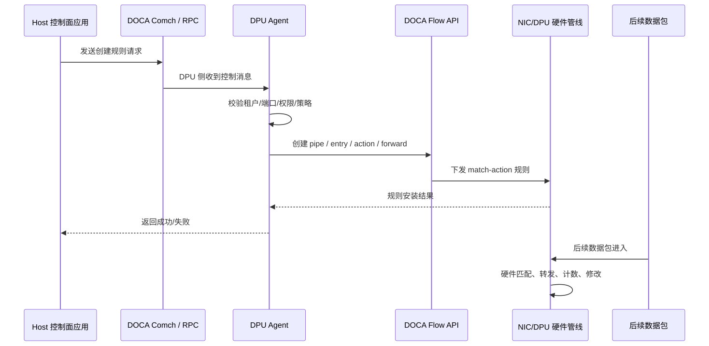
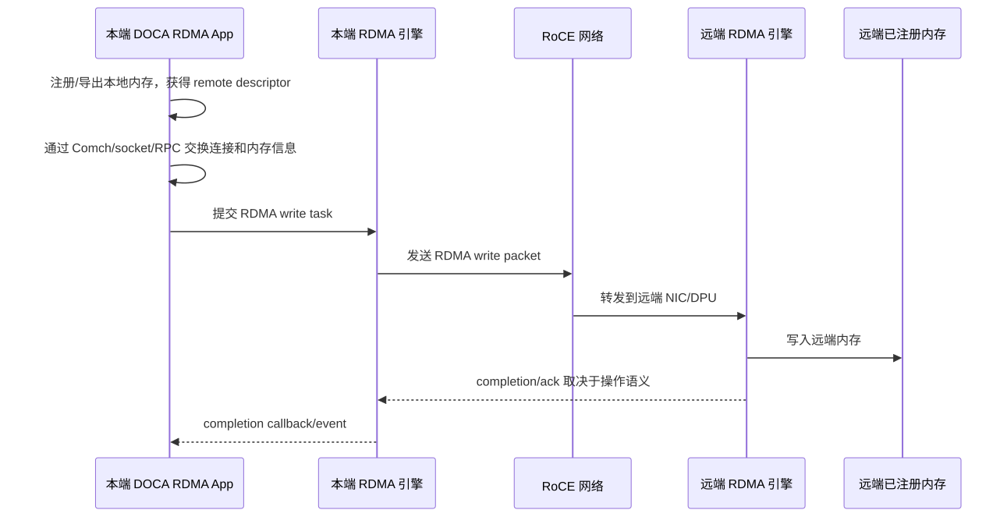

# 03. 架构与卸载原理：Host、DPU ARM、硬件快路径如何分工

## 1. 为什么要先讲分工

学习 DOCA 最大的坑，是把“硬件卸载”理解成“所有事情都由硬件自动完成”。实际不是这样。

DOCA 系统里通常有三类执行者：

1. **Host CPU**：运行业务应用、控制面客户端、虚拟机/容器；
2. **DPU ARM CPU**：运行 DPU OS、DOCA agent、服务、慢路径逻辑；
3. **DPU/NIC 硬件**：执行 fast path，例如转发、匹配、DMA/RDMA、加密、压缩等。

只有把三者分清，后面理解 Flow、Comch、DMA、RDMA、SNAP 才不会混乱。

## 2. 控制面与数据面

| Plane | 职责 | 典型执行者 | DOCA 相关模块 |
|---|---|---|---|
| 控制面 Control Plane | 发现设备、创建资源、建立连接、安装规则、配置策略 | Host CPU、DPU ARM、外部 Controller | Core、Comch、Management、doca_caps、service API |
| 数据面 Data Plane | 高频处理数据包/数据块/IO 请求 | DPU/NIC 硬件，必要时 DPU ARM 慢路径 | Flow、DMA、RDMA、SNAP、crypto、compress |
| 慢路径 Slow Path | flow miss、异常包、错误处理、admin 命令 | DPU ARM 或 Host CPU | Flow miss handling、agent、日志、telemetry |
| 快路径 Fast Path | 已安装规则/已建立资源上的重复处理 | 硬件 pipeline/engine | Flow steering、DMA engine、RDMA engine |

## 3. 典型请求生命周期

以“Host 让 DPU 为某个租户创建网络规则”为例：

注意：控制消息走软件；规则安装之后，符合规则的数据包走硬件。

## 4. “卸载”的几种层次

### 4.1 Host CPU 卸载到 DPU ARM

这不是硬件卸载，而是把基础设施 agent 从 Host 迁移到 DPU ARM。

例子：

- Host 上不再跑安全 agent，改由 DPU 侧 agent 管理策略；
- Host 控制面只发命令，DPU agent 负责资源管理；
- 存储虚拟化服务运行在 DPU，不占用 Host 业务 CPU。

优点：隔离更好，Host CPU 压力更小。缺点：DPU ARM 本身也有 CPU 资源限制。

### 4.2 软件慢路径 + 硬件快路径

这是网络/存储系统常见模式。

- 新连接、异常请求、策略变化：软件处理；
- 稳定的重复流量：硬件处理。

DOCA Flow 就是典型例子：软件创建 pipe/entry，硬件执行 match-action。

### 4.3 特定计算/搬运引擎卸载

DMA、RDMA、crypto、compress、regex/erasure coding 等能力属于“任务提交 + 硬件执行”模型：

1. 软件准备上下文、内存、buffer、任务；
2. 软件提交 task；
3. 硬件执行复制/传输/计算；
4. 软件通过 completion callback 或 event 收到结果。

### 4.4 完整设备/协议仿真

SNAP/DevEmu 这类场景更复杂：Host 看到一个标准设备，DPU 侧模拟设备行为并把请求转到后端。

## 5. 关键模块在架构中的位置

| 模块 | Plane | 主要作用 | 谁执行 |
|---|---|---|---|
| DOCA Core | 基础设施 | 设备、内存、buffer、task、PE 抽象 | Host CPU 或 DPU ARM 调 API |
| DOCA Flow | 数据面配置 | 创建网络 match-action 管线 | 软件下发规则，硬件转发 |
| DOCA Comch | 控制面通信 | Host↔DPU 消息/RPC 通道 | Host/DPU 软件 |
| DOCA DMA | 数据搬运 | DOCA buffer 间内存复制 | 软件提交，DMA 引擎执行 |
| DOCA RDMA | 远端数据搬运 | send/recv/read/write/atomic | 软件建连/提交，RDMA 引擎传输 |
| DOCA SNAP | 存储/设备虚拟化 | 暴露 NVMe/virtio 等设备，后端转发 | DPU 服务 + 硬件/后端 |
| Telemetry | 观测 | 指标、事件、调试信息 | 服务/agent/导出器 |

## 6. 数据路径示例：网络包

## 7. 数据路径示例：RDMA write

## 8. 判断一个 DOCA 设计是否合理

可以用以下问题自查：

1. 哪些逻辑必须在 Host 上？哪些可以放到 DPU ARM？
2. 数据面是否足够规则化，能下发到硬件 fast path？
3. 控制面消息频率是否低于数据面？如果控制面很频繁，DPU ARM 是否会成为瓶颈？
4. 内存所有权、注册、导出、权限是否清晰？
5. RDMA/Flow/DMA 能力是否在目标设备上通过 `doca_caps` 确认？
6. 失败路径如何处理？flow miss、连接断开、task error、device reset 怎么恢复？

## 技术细节补充：快路径到底快在哪里

DOCA fast path 的核心不是“API 调用快”，而是把高频操作从通用 CPU 循环变成硬件表项、队列或引擎任务：

| 能力 | 控制面动作 | 快路径动作 | 典型性能约束 |
|---|---|---|---|
| Flow | 创建 pipe/entry/action/fwd | 硬件 parser + match/action + queue/port 转发 | 表项规模、action 组合、miss 率 |
| DMA | 注册内存、创建 buf、提交 copy task | DMA engine 搬运数据 | PCIe 带宽、buffer 大小、task 并发 |
| RDMA | 建立连接、注册/导出内存、提交 op | NIC/RDMA engine 发送/接收/读写 | RoCE 网络、QP/CQ、MTU、拥塞控制 |
| SNAP | 创建 controller/namespace/queue | Host 标准驱动发 IO，DPU/后端处理 | queue depth、后端延迟、reset/flush 语义 |
| Crypto/Compress | 配置 key/算法/buf/task | 硬件或专用引擎处理数据块 | 块大小、批量、算法支持 |

### Completion 不等于业务完成

很多 DOCA/RDMA completion 只说明某个底层任务达到指定语义。例如：

- DMA completion：目标 buffer 已按 DMA 语义写入，但应用是否消费需要上层同步。
- RDMA write completion：本端 RDMA 操作完成，不一定意味着远端应用已经处理数据。
- Flow entry add 成功：规则已安装，但还要用 counter/抓包/Flow Inspector 验证命中。
- 存储 IO completion：必须满足协议要求的 flush/order/error 语义，不能只看数据传输结束。

## 性能/调优视角

- **降低 slow path 比例**：Flow miss、异常包、控制面频繁下发规则都会吃 DPU ARM/Host CPU。
- **批量控制面变更**：规则更新、资源创建、Comch 请求尽量 batch，避免抖动。
- **资源池化**：QP、mmap、task、buf inventory、Flow pipe 预创建或复用。
- **避免跨层重复 copy**：Host buffer → DPU buffer → remote buffer 每多一次 copy 都要证明必要性。
- **隔离控制面和数据面线程**：DPU agent 慢路径不要阻塞 completion/poll thread。

## 开发中常见问题

| 现象 | 架构层原因 | 建议 |
|---|---|---|
| 吞吐上不去 | fast path 没命中或任务太小 | 用 counter/telemetry 验证路径，增大 batch/queue depth |
| p99 抖动 | slow path、控制面抢 CPU、RoCE 拥塞 | 分层采集 Host/DPU/网络指标 |
| 规则安装成功但流量不通 | port/domain/representor/miss 方向错 | 画实际路径，用 Flow Inspector 和 counter 验证 |
| DPU ARM 打满 | 把过多逻辑放到 agent/慢路径 | 下沉到 Flow/DMA/RDMA，或减少控制面频率 |
| 失败后资源残留 | 没有生命周期状态机 | 所有资源带 owner/id/state，支持幂等删除 |

## 9. 学完本章应该记住

1. DOCA 的核心是重新划分 Host CPU、DPU ARM、硬件 fast path 的职责。
2. Comch 是控制面通信，不是数据面加速本身。
3. Flow 是软件配置、硬件执行的网络数据面模型。
4. DMA/RDMA 是软件提交 task、硬件搬运数据的异步模型。
5. SNAP/DevEmu 把 DPU 变成 Host 眼中的标准设备提供者。

## 10. 下一步

继续阅读：[04. DOCA Core 编程模型](04-doca-core-programming-model.md)。
