# 04. DOCA Core 编程模型

## 1. 为什么先学 DOCA Core

DOCA Flow、DMA、RDMA、Comch 等库看起来不同，但它们共享一套 Core 抽象：

- device / devinfo；
- memory map；
- buffer inventory / buffer；
- context；
- task / event；
- progress engine；
- callback；
- state machine。

理解这些对象后，再看各模块 API 会简单很多。

## 2. 核心对象关系



## 3. device：先找到能做事的设备

典型流程：

1. 枚举 `doca_devinfo`；
2. 用 capability API 判断设备是否支持目标 task；
3. 打开 `doca_dev`；
4. 必要时找到 representor device；
5. 把 device 绑定到模块对象。

为什么不能跳过能力判断？因为不同设备、固件、PF/VF/SF/representor、Host/DPU 侧能力不同。

例如 DMA 会有类似问题：

- 是否支持 memcpy task；
- 最大 task 数量；
- 最大 buffer size；
- 最大 buffer list length。

RDMA 会涉及：

- send/recv/read/write/atomic 是否支持；
- 是否支持 DPA/GPU datapath；
- 多连接限制；
- 内存导出能力。

## 4. memory：mmap、buf inventory、buf

DOCA 不直接拿裸指针做所有事情，而是通过内存对象描述哪些内存可以被设备访问。

### 4.1 doca_mmap

`doca_mmap` 可以理解为“把一段内存注册到 DOCA 设备可访问域”。

常见用途：

- 本地 DMA copy；
- RDMA local/remote memory；
- Host↔DPU 共享内存；
- 导出给对端使用。

### 4.2 doca_buf_inventory

`doca_buf_inventory` 管理 buffer descriptor 池。它不是数据本身，而是描述数据的对象集合。

### 4.3 doca_buf

`doca_buf` 描述一段实际 buffer：

- 地址；
- 长度；
- 数据区域；
- 所属 mmap；
- 可被哪些 device/engine 访问。

## 5. ctx：模块统一上下文

每个具体模块通常有自己的对象：

- `doca_dma`；
- `doca_rdma`；
- `doca_comch_server/client`；
- 其他模块对象。

它们通常可以转成 `doca_ctx`，这样就能接入统一生命周期：

1. create module object；
2. set configuration；
3. connect to PE；
4. start ctx；
5. submit tasks/events；
6. stop ctx；
7. destroy。

## 6. task：异步任务模型

DOCA DMA/RDMA/Comch 等大量操作不是阻塞函数，而是 task：

1. 配置 task 类型的 callback 和最大数量；
2. allocate/init task；
3. submit task；
4. 调 `doca_pe_progress()` 推进；
5. 在 completion/error callback 中处理结果；
6. 释放或复用 task。

这与很多高性能 IO 框架类似：提交描述符，然后轮询/事件驱动地收 completion。

## 7. PE：Progress Engine

`doca_pe` 是 DOCA 异步模型的推进器。

你可以把它理解为：

- 统一管理多个 ctx 的 progress；
- 推进 task 状态；
- 触发 callback；
- 支持轮询、事件、reactive 等不同模式。

最简单的程序通常会写一个循环：

```c
while (!done) {
    doca_pe_progress(pe);
}
```

真实程序会加入超时、事件 fd、批量处理、多个 context、错误恢复等。

## 8. 生命周期状态机

很多 DOCA ctx 都有类似状态：



常见错误是：

- start 之前没有设置 mandatory configuration；
- ctx 没有连接 PE；
- callback 没设就提交 task；
- mmap/buf 生命周期早于 task 结束；
- stop/destroy 时还有未完成 task。

## 9. 一个通用伪代码模板

```c
// 1. 找设备并检查能力
find_devinfo_that_supports_my_task();
doca_dev_open(devinfo, &dev);

// 2. 创建模块对象并转 ctx
create_module(&module);
ctx = module_as_ctx(module);

// 3. 创建 PE 并连接 ctx
doca_pe_create(&pe);
doca_pe_connect_ctx(pe, ctx);

// 4. 设置 task callback / max task / 必需配置
module_task_set_conf(module, success_cb, error_cb, max_tasks);
module_set_device(module, dev);

// 5. 准备内存
create_mmap_and_register_memory(dev, &mmap);
create_buf_inventory(&inv);
create_buf_from_mmap(inv, mmap, &buf);

// 6. start ctx
doca_ctx_start(ctx);

// 7. 创建并提交 task
module_task_allocate(module, src_buf, dst_buf, user_data, &task);
doca_task_submit(task_as_doca_task(task));

// 8. 推进直到完成
while (!done)
    doca_pe_progress(pe);

// 9. 清理
free_task();
doca_ctx_stop(ctx);
destroy_buf_inventory();
destroy_mmap();
doca_pe_destroy(pe);
doca_dev_close(dev);
```

## 10. 日志与错误处理

官方 DOCA Log 文档提供了日志 API。一个最小 “Hello DOCA” 通常可以只验证头文件/链接/运行环境：

```c
#include <stdio.h>
#include <doca_log.h>

DOCA_LOG_REGISTER(HELLO_DOCA);

int main(int argc, char **argv)
{
    doca_log_backend_create_standard();
    DOCA_LOG_INFO("Hello, DOCA!");
    printf("Hello from normal printf too.\n");
    return 0;
}
```

如果 `pkg-config` 存在相关条目，可以先探索：

```bash
pkg-config --list-all | grep -i doca
```

不要在不知道安装版本和路径时硬写编译参数。

## 技术细节补充：对象生命周期与异步语义

### 典型资源依赖顺序

```text
doca_devinfo -> doca_dev
              -> module object -> doca_ctx -> doca_pe
memory pointer -> doca_mmap -> doca_buf_inventory -> doca_buf -> task
```

销毁时通常反向执行，并确保：

1. 没有未完成 task；
2. ctx 已 stop 或进入可销毁状态；
3. callback 不会再访问即将释放的 user data；
4. mmap/buf 生命周期覆盖所有硬件访问；
5. 多线程程序中没有其他线程仍在 progress 或提交。

### 常见 Core 名词

| 名词 | 技术细节 |
|---|---|
| Mandatory configuration | ctx start 前必须设置的 device、callback、task 数、connection 参数等；缺失会 start 失败。 |
| User data | task/context 关联的应用指针/值，常用于 callback 找回请求对象。生命周期必须自管。 |
| State change | ctx start/stop 可能异步完成，错误路径也会触发状态变化。 |
| Event vs Task | task 是主动提交的工作；event 是连接变化、接收消息、状态变化等异步事件。 |
| Buffer data length | buffer 容量和实际有效数据长度要区分，DMA/RDMA/crypto 常依赖正确设置。 |
| Export/import | mmap 可被导出给另一个设备/对端；这不是复制数据，而是传递访问描述符/权限。 |

## 性能/调优视角

- **预分配 task/buf inventory**：高频路径不要反复 malloc/create/destroy。
- **复用 mmap**：内存注册通常昂贵，应在初始化或连接建立时完成。
- **选择 PE 模式**：低延迟用 busy polling，低 CPU 用事件/reactive；两者取舍要测 p99。
- **callback 轻量化**：只更新状态、入队结果，不做阻塞 IO、复杂日志、锁竞争重的操作。
- **批量 progress**：一次 progress 后尽量处理多个 completion，减少系统调用/锁开销。
- **错误码标准化**：把 DOCA error、errno、ctx state、resource id 一起记录，避免只看到“failed”。

## 开发中常见问题

| 问题 | 说明 | 规避 |
|---|---|---|
| 忘记 progress | task 不会自己完成到应用层 | 独立 poll loop 或事件循环，配 watchdog |
| start 顺序错误 | callback/PE/device/task conf 未设置 | 写统一 init 函数和状态断言 |
| 释放过早 | mmap/buf/user data 被 callback 或硬件继续访问 | 引用计数或请求状态机 |
| 线程安全误判 | 多线程同时 submit/progress/destroy | 按官方说明加锁或单线程 owner 模型 |
| 只处理成功回调 | error callback 未覆盖，资源泄露 | success/error 都走统一 completion path |
| 忽略 capability limit | task 数/buffer size 超限 | 初始化时读 capability 并打印配置摘要 |

## 11. 学完本章应该记住

1. DOCA Core 提供所有模块共享的设备、内存、buffer、ctx、task、PE 模型。
2. DOCA 编程通常是异步 task + progress engine，而不是同步阻塞调用。
3. 能力探测和 mandatory configuration 是 start ctx 之前的关键步骤。
4. 内存注册/导出与 buffer 生命周期是 DMA/RDMA 编程的核心。
5. 后续学 DMA/RDMA 时，重点是把具体 task 类型套进这个通用模型。

## 12. 下一步

继续阅读：[05. DOCA Flow 网络数据面](05-doca-flow-network-datapath.md)。
