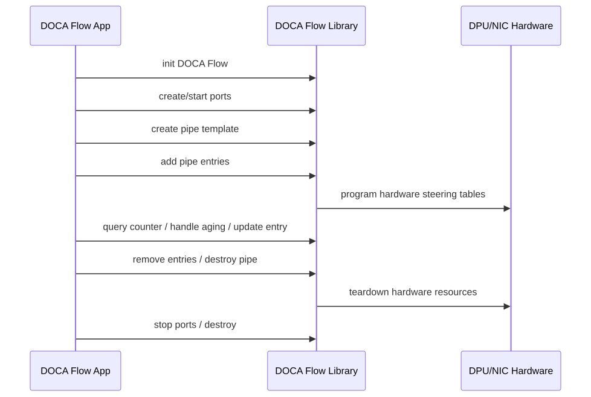

# 05. DOCA Flow：网络数据面与硬件转发管线

## 1. DOCA Flow 解决什么问题

DOCA Flow 是用于编程 DPU/NIC 网络数据面的库。它把网络处理抽象成硬件可执行的 match-action pipeline：

- match：匹配包头、metadata、端口、隧道字段等；
- action：drop、forward、modify、encap/decap、count、meter、rss 等；
- pipe：一组规则的模板/阶段；
- entry：具体规则实例；
- forward/miss：命中后或未命中时去哪里。

它适合把高频、规则化、可硬件表达的数据包处理放到 NIC/DPU fast path。

## 2. 基本心智模型



## 3. Flow 与传统软件网络栈的区别

| 维度 | 传统软件处理 | DOCA Flow |
|---|---|---|
| 执行位置 | Host CPU 或 DPU ARM CPU | NIC/DPU 硬件 fast path，软件负责配置 |
| 表达方式 | 任意代码逻辑 | 硬件支持的 match-action 模型 |
| 优点 | 灵活 | 高吞吐、低延迟、低 CPU 占用 |
| 限制 | CPU 成本高 | 受硬件能力、字段、action、表项规模限制 |
| 调试方式 | 日志、抓包、perf | doca_caps、Flow Inspector、计数器、管线导出 |

## 4. Flow 的常见对象

| 对象 | 作用 |
|---|---|
| port | 数据包进入/离开 DOCA Flow 的端口抽象 |
| pipe | 规则模板/处理阶段 |
| pipe entry | 具体匹配项和 action 参数 |
| match | 匹配字段 |
| action | 对数据包执行的操作 |
| monitor | count、meter、aging 等监控能力 |
| fwd | 命中后的转发目标 |
| miss | 未命中处理 |
| shared resource | 共享 action、meter、counter 等资源 |

## 5. Flow 生命周期



## 6. 应用场景示例

### 6.1 安全组/ACL



### 6.2 隧道封装/解封装

- VxLAN/Geneve tunnel encap/decap；
- 租户网络 ID 映射；
- underlay/overlay 转发；
- 入口解封装后进入 ACL pipe，出口再封装。

### 6.3 连接跟踪与服务链

Flow CT 可用于 connection tracking 相关场景。服务链可把流量转给安全服务、IDS、代理或慢路径队列。

### 6.4 存储/控制流量 steering

在存储系统中，可以用 Flow 把 NVMe-oF/RDMA/TCP 等流量按端口、队列、tenant、backend steering 到不同处理路径。

## 7. Flow 与 representor

在 DPU/虚拟化模式下，representor 是理解流量路径的关键。


DPU agent 通常通过 representor 感知和控制 Host/VF/SF 的流量。

## 8. 硬件模式与限制

Flow 不是无限灵活的通用程序执行环境，它受硬件 steering 能力影响：

- 支持哪些 match 字段；
- 支持哪些 action；
- pipe 类型、domain、port/representor 路径；
- 表项规模；
- aging/counter/meter 限制；
- RSS/queue/port/hairpin 限制；
- VNF mode / switch mode 差异。

> 版本提醒：较新的 DOCA Flow 版本已经移除了早期显式设置 flow direction 的 API。学习时可以把“方向”理解成流量所在的 domain、port、representor 和转发路径选择，不要把它等同于一个固定的 direction 配置项。

开发前要查：

```bash
/opt/mellanox/doca/tools/doca_caps --list-devs
/opt/mellanox/doca/tools/doca_caps --list-libs
/opt/mellanox/doca/tools/doca_caps
```

## 9. Flow 调试思路

1. **先确认能力**：设备是否支持 flow、目标 action、目标 domain。
2. **先跑官方 sample**：不要一开始写复杂 pipeline。
3. **给每个关键 pipe 加 counter**：验证命中情况。
4. **从单 pipe 开始**：match + drop/forward，逐步加 action。
5. **明确 miss 路径**：未命中是 drop、next pipe、queue 还是 slow path。
6. **使用 Flow Inspector**：官方有 DOCA Flow Inspector Service Guide，可导出/检查 flow pipeline。

## 10. 一个简化设计：租户网络 ACL

需求：

- 租户 A 的 VM 只能访问指定 backend；
- 非法源地址丢弃；
- 合法流量计数后转发。

设计：



控制面：

- 外部 controller 产生租户策略；
- DPU agent 通过 Comch/RPC 接收；
- DPU agent 调 DOCA Flow API 创建/更新 entries；
- Telemetry 导出 counters。

## 技术细节补充：Flow 管线对象与设计方法

### Pipe 设计常见层次

| 层次 | 例子 | 目的 |
|---|---|---|
| 入口分类 | ingress port、representor、VLAN、tenant metadata | 快速确定租户/来源 |
| L2/L3/L4 匹配 | MAC/IP/TCP/UDP/端口 | 实现 ACL、安全组、服务识别 |
| Tunnel 处理 | VXLAN/Geneve encap/decap、VNI | 云网络 overlay/underlay 转换 |
| 策略动作 | drop、forward、modify、count、meter | 执行安全/转发/QoS |
| 出口选择 | uplink、representor、queue、RSS、hairpin | 选择下一跳或软件队列 |

### 技术名词补充

| 名词 | 解释 |
|---|---|
| Steering domain | Flow 规则所在的转发域和端口路径选择；不同模式下 domain、port、representor 支持不同。 |
| Pipe chaining | 一个 pipe 命中后转到下一个 pipe，用多级表减少规则重复。 |
| Priority | 多条规则都可能匹配时的优先级控制。 |
| Shared resource | 多个 entry 共享 counter/meter/action 等资源。 |
| Aging | 规则空闲超时回收，常用于短连接表。 |
| RSS queue | 把流量 hash 到多个 receive queue，提高并行处理能力。 |
| Hairpin | 设备内部队列间转发，避免包回到 Host 软件栈。 |
| Flow Inspector | 官方服务/工具，用于导出和检查 Flow pipeline。 |

## 性能/调优视角

- **减少表项爆炸**：把公共匹配放在前级 pipe，租户/连接细节放后级 pipe。
- **控制 rule churn**：规则频繁增删会造成控制面压力；能聚合就聚合，能用 aging 就别手动扫全表。
- **谨慎开 counter**：counter 有资源成本；关键规则和抽样规则优先。
- **使用 RSS/多队列**：如果 slow path 或软件队列成为瓶颈，检查 RSS hash 和 CPU affinity。
- **miss path 显式化**：所有 pipe 都应知道 miss 是 drop、forward、next pipe 还是 queue。
- **先小后大压测**：先 1 条规则、再 1k、10k、100k；分别测插入速率、命中吞吐、删除/aging 成本。

## 开发中常见问题

| 现象 | 可能原因 | 排查 |
|---|---|---|
| 无流量命中 | representor/uplink/port 选错，domain 或路径选择不匹配 | counter、抓包、Flow Inspector、`doca_caps --list-rep-devs` |
| 规则无法创建 | match/action 组合不支持或资源不足 | 查 capability、减少 action、拆 pipe |
| 命中了但转发错 | fwd 目标或 miss 目标设置错 | 给每段 pipe 加 counter，画实际路径 |
| 性能随规则数下降 | 表结构不合理或硬件资源接近上限 | 多级 pipe、优先级压缩、减少细粒度规则 |
| DPU ARM CPU 高 | flow miss 太多或控制面更新太频繁 | 降低 miss、批量更新、缓存策略结果 |

## 11. 学完本章应该记住

1. DOCA Flow 是硬件 match-action 网络管线，不是任意 C 代码执行。
2. 软件负责创建 pipe/entry，硬件负责高频包处理。
3. Flow 适合 ACL、转发、隧道、计数、steering、服务链等规则化场景。
4. representor 是 DPU 虚拟化网络路径中的关键入口。
5. Flow 调试要重视能力探测、counter、miss 路径和 Flow Inspector。

## 12. 下一步

继续阅读：[06. DOCA Comch 控制通道](06-doca-comch-control-channel.md)。
