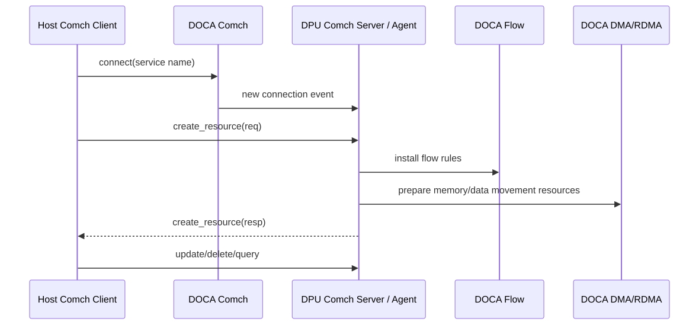
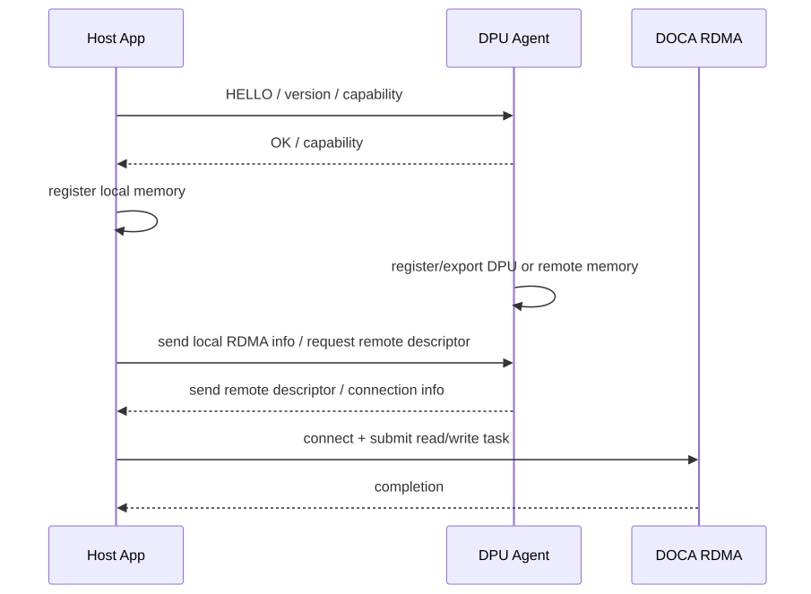
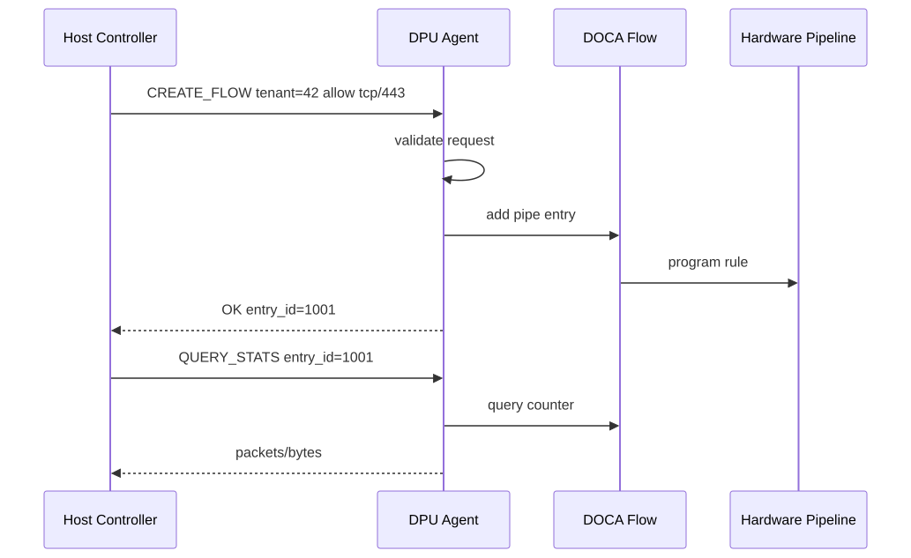

# 06. DOCA Comch：Host↔DPU 控制通道

## 1. Comch 是什么

DOCA Comch，即 DOCA Communication Channel，是 Host 与 DPU 之间的通信通道库。它主要服务控制面：

- Host client 向 DPU agent 发送命令；
- DPU agent 返回状态、错误、资源 ID；
- 两边交换元数据，例如 RDMA 连接信息、内存导出描述符、flow 配置参数；
- DPU 侧服务与 Host 侧控制程序协作。

Comch 本身不是“硬件快路径”。它更像 Host 和 DPU 之间的 RPC/消息通道。真正的数据面加速通常由 Flow、DMA、RDMA、SNAP、crypto 等模块完成。

## 2. 典型结构



## 3. Comch 在系统中的位置

| 模块 | 作用 |
|---|---|
| Comch | 交换控制消息和元数据 |
| Flow | 根据控制消息下发网络规则 |
| DMA | 根据控制消息执行或准备内存搬运 |
| RDMA | 建立远端连接、交换内存信息后执行远端读写 |
| SNAP | Host 控制面可通过 DPU agent 管理虚拟存储设备 |

一句话：**Comch 负责“告诉 DPU 做什么”，不是“替代数据面做高速搬运”。**

## 4. Server / Client 模型

DOCA Comch 官方文档中包含 server/client/consumer/producer 等对象与初始化流程。常见模式：

- DPU 侧启动 server，监听某个 service name；
- Host 侧启动 client，连接 server；
- 连接建立后，两边通过 send task / receive event 交换消息；
- server 处理 connection status changed event；
- 退出时断开连接并清理 ctx/PE/资源。



## 5. 消息设计

Comch 只提供通道，真正的协议需要你设计。建议一开始就定义清楚：

```c
struct request_header {
    uint32_t magic;
    uint16_t version;
    uint16_t opcode;
    uint32_t request_id;
    uint32_t payload_len;
};
```

常见 opcode：

| opcode | 含义 |
|---|---|
| HELLO | 协商版本、能力、身份 |
| CREATE_FLOW | 创建 Flow pipe/entry |
| DELETE_FLOW | 删除 Flow entry |
| REGISTER_MEMORY | 注册/导出内存 |
| RDMA_CONNECT | 交换 RDMA 连接信息 |
| START_IO | 启动 DMA/RDMA/存储任务 |
| QUERY_STATS | 查询 counter/telemetry |
| ERROR | 返回错误详情 |

## 6. Comch + RDMA 的典型组合

RDMA 本身需要交换连接信息和内存描述符。Comch 可以承担这个控制通道：



重点：

- capability query 回答“这个环境能不能做、限制是多少”；
- memory registration/export 回答“这段内存能否被这个 device/peer 访问”；
- Comch 负责交换描述符，不负责执行 RDMA 数据搬运。

## 7. Comch + Flow 的典型组合

Host 控制程序想动态创建网络规则时：



## 8. 安全注意事项

因为 Comch 是控制面入口，必须认真做校验：

- 协议版本和 magic；
- 请求长度边界；
- opcode 白名单；
- 租户/资源归属；
- 防止 Host client 要求 DPU 操作不属于它的资源；
- timeout 和重试；
- 连接断开时回收资源；
- 日志中避免泄露密钥、内存地址、token。

## 9. 什么时候不用 Comch

不一定所有 Host↔DPU 控制都必须用 Comch。也可以使用：

- TCP/Unix socket；
- gRPC/REST；
- RDMA CM；
- Kubernetes CRD/operator；
- vendor service API；
- 配置文件/CLI。

选择 Comch 的典型理由：你在写紧贴 DOCA 的 Host/DPU 成对应用，希望使用 DOCA 提供的通信抽象和设备上下文。

## 技术细节补充：协议设计比通道本身更重要

Comch 提供 Host↔DPU 通道，但生产可用性取决于你在通道上定义的协议。

### 推荐消息头

```c
struct msg_header {
    uint32_t magic;       // 防止误解析
    uint16_t version;     // 协议版本
    uint16_t opcode;      // 请求类型
    uint32_t flags;       // ack/trace/retry 等标志
    uint64_t request_id;  // 关联日志和响应
    uint32_t payload_len; // 边界检查
    uint32_t checksum;    // 可选，防止数据损坏
};
```

### 状态与资源管理

| 机制 | 作用 |
|---|---|
| HELLO/capability | 协商版本、功能、最大消息、认证信息 |
| request/response | 每个控制操作必须有明确结果和错误码 |
| idempotency key | 重试 CREATE/DELETE 时避免重复创建或误删 |
| resource owner | 每个 Flow/RDMA/volume 资源记录 tenant/client/connection |
| disconnect cleanup | client 断开后按策略回收或保留资源 |
| heartbeat | 检测 Host/DPU agent 是否还活着 |

## 性能/调优视角

- Comch 用于小消息和元数据，避免传大 buffer；大数据走 DMA/RDMA/SNAP 队列。
- 对规则下发、volume 创建等操作做 batch，减少往返和 DPU agent 调度开销。
- 限制每个连接的 outstanding 请求数，避免 Host 把 DPU agent 打爆。
- 对高频状态查询使用订阅/增量/采样，不要每毫秒全量拉取。
- 日志按 request_id 采样，避免控制面洪峰时日志成为瓶颈。

## 开发中常见问题

| 问题 | 说明 | 处理 |
|---|---|---|
| 连接失败 | server 未启动、service name 错、设备侧不一致 | 先跑官方/最小 Comch sample，再接业务协议 |
| 协议升级失败 | Host/DPU 二进制版本不同 | HELLO 阶段协商版本和 feature bitmap |
| payload 越界 | 长度字段不可信 | 所有 payload 先做长度和 opcode 校验 |
| 断连资源泄露 | connection 与资源生命周期没绑定 | resource registry + owner + cleanup policy |
| 重试导致重复操作 | CREATE 非幂等 | request_id/idempotency key + 查询已有资源 |
| 安全边界薄弱 | Host client 可请求任意资源 | tenant、capability、ACL、审计必须在 DPU agent 校验 |

## 10. 学完本章应该记住

1. Comch 是 Host↔DPU 控制通道，不是数据面加速器。
2. 它常与 Flow、DMA、RDMA、SNAP 组合，用于下发命令和交换元数据。
3. Comch server 常在 DPU 侧，client 常在 Host 侧，但具体部署取决于应用。
4. 协议格式、版本协商、权限校验、资源回收需要应用自己设计。
5. 做 RDMA 时，Comch 很适合交换连接信息和 memory export descriptor。

## 11. 下一步

继续阅读：[07. DOCA DMA 内存搬运](07-doca-dma-memory-movement.md)。
