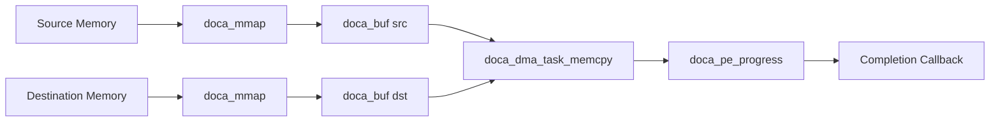
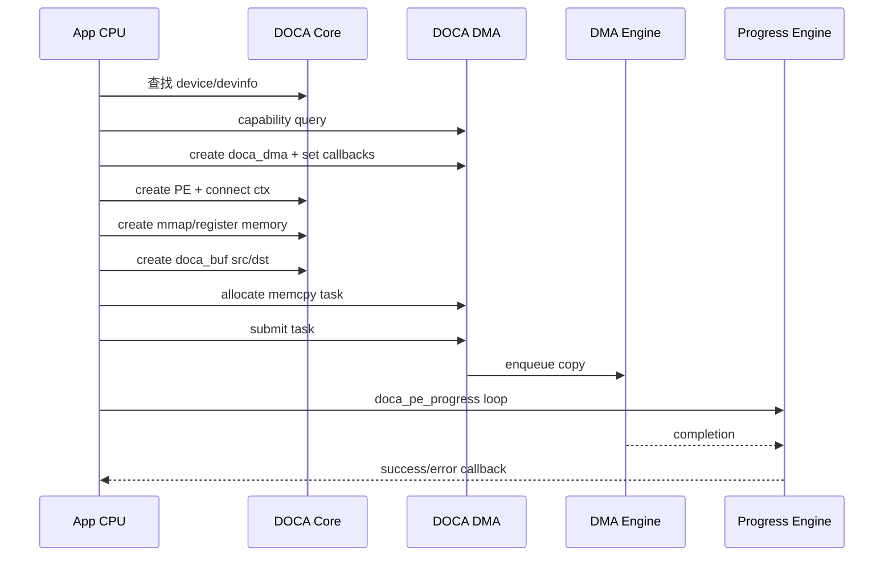
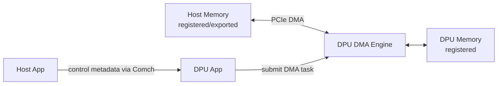

# 07. DOCA DMA：内存搬运模型

## 1. DMA 在 DOCA 中解决什么问题

DOCA DMA 提供在 DOCA buffers 之间复制数据的 API，并尽量使用硬件 DMA 引擎完成数据搬运。它适合：

- Host 内存与 DPU 可访问内存之间搬运；
- DPU 内部不同 memory region 之间搬运；
- 为存储/网络/安全 pipeline 准备数据；
- 避免让 CPU 用 `memcpy()` 搬大量数据。

注意：软件仍需要准备内存、提交 task、处理完成事件。DMA 引擎负责实际数据复制。

## 2. 与 CPU memcpy 的区别

| 维度 | CPU memcpy | DOCA DMA |
|---|---|---|
| 执行者 | CPU core | DMA engine，视硬件支持 |
| 内存要求 | 普通进程虚拟地址即可 | 需要 DOCA mmap/buf 描述，设备可访问 |
| 编程模型 | 同步函数调用 | 异步 task + progress engine |
| 优点 | 简单、低门槛 | 可降低 CPU 占用，适合大块/批量搬运 |
| 成本 | 占 CPU cache/带宽 | 有注册、提交、completion 成本 |

## 3. 基本对象

## 4. 典型 API/能力点

官方 DOCA DMA 文档围绕这些概念展开：

- `doca_dma` 模块对象；
- `doca_dma_as_ctx()` 转换为通用 `doca_ctx`；
- `doca_dma_task_memcpy_set_conf()` 配置 memcpy task callback 和数量；
- `doca_dma_cap_task_memcpy_is_supported()` 查询设备是否支持；
- `doca_dma_cap_get_max_num_tasks()` 查询最大 task 数；
- `doca_dma_cap_task_memcpy_get_max_buf_size()` 查询最大 buffer；
- `doca_dma_cap_task_memcpy_get_max_buf_list_len()` 查询 buffer list 限制；
- `doca_dma_task_memcpy` 表示一次 DMA copy 任务；
- `doca_pe_progress()` 推进任务完成。

具体函数签名请以安装的 DOCA 头文件和官方 API 文档为准。

## 5. 标准流程

## 6. Host↔DPU 内存搬运

Host 与 DPU 之间搬运数据时，通常涉及：

- 哪一侧发起 DMA task；
- Host 内存是否 pinned/registered；
- DPU 是否有权限访问 Host memory；
- 是否需要通过 PCIe export/import memory descriptor；
- memory lifetime 是否覆盖 task lifetime。

简化示意：

## 7. DMA 与 RDMA 的区别

| 项目 | DOCA DMA | DOCA RDMA |
|---|---|---|
| 范围 | 本地/设备可访问内存之间 copy | 跨网络访问远端内存 |
| 网络 | 不一定需要 | 需要 RDMA/RoCE/IB 网络 |
| 连接 | 主要是本地 device/memory 关系 | 需要 RDMA connection 或地址交换 |
| 远端内存 | 通常不是核心概念 | 必须注册/导出并交换 remote descriptor |
| 典型任务 | memcpy | send/recv/read/write/atomic |

可以这样记：DMA 是“本机/本设备域的数据搬运”；RDMA 是“跨节点/跨网络的远端内存访问”。

## 8. 常见坑

1. **没有能力检查**：目标设备不支持 memcpy task 或限制比预期小。
2. **内存没注册**：裸指针不能直接给 DMA 引擎用。
3. **buffer 范围错误**：src/dst length、offset、data length 不匹配。
4. **生命周期错误**：task 还没完成，内存或 buf 被释放。
5. **忘记 progress**：提交 task 后没有推进 PE，callback 不会被调用。
6. **过度小块 copy**：太小的 copy 可能不值得走 DMA，提交开销盖过收益。
7. **Host/DPU 权限不清**：跨 PCIe 访问需要正确 export/import 和权限配置。

## 9. 适合练习的最小实验

实验目标：在同一侧做 local DMA copy。

步骤：

1. 用 `doca_caps` 确认 dma installed 和设备支持；
2. 申请一块 src 和 dst 内存；
3. src 填充固定模式；
4. 创建 mmap/buf；
5. 提交 memcpy task；
6. progress 到 completion；
7. 比较 dst 与 src 内容。

通过后再扩展：

- Host↔DPU copy；
- 多 task 并发；
- 大块 buffer；
- 和 Comch 协作交换内存元数据；
- 和存储/网络 pipeline 组合。

## 技术细节补充：DMA 不是“换个 memcpy 名字”

### DMA copy 的关键语义

| 维度 | 需要明确的问题 |
|---|---|
| 访问权限 | DMA engine 是否能访问 src/dst 所在内存？是否需要 export/import？ |
| 方向 | Host→DPU、DPU→Host、device local、remote exported memory？ |
| 一致性 | CPU 写完 src 后，设备是否看到最新数据？DMA 写完 dst 后，CPU 何时可读？ |
| 粒度 | 单次 copy 多大？是否支持 scatter/gather 或 buffer list？ |
| 生命周期 | task 完成前，src/dst/mmap/buf 是否保持有效？ |
| 错误恢复 | 部分提交、ctx stop、device reset 时如何回收？ |

### 与 cache/coherency 的关系

在某些平台上，CPU cache、IOMMU、PCIe DMA 一致性需要按官方平台指南处理。不要假设所有内存都天然 coherent。写 DOCA DMA 实验时，建议：

1. src 填充后再提交 task；
2. completion 后再检查 dst；
3. 如果平台要求 cache flush/invalidate，按官方示例处理；
4. 不在 task 未完成时让 CPU/DMA 同时写同一 buffer。

## 性能/调优视角

- **块大小**：几十字节的小 copy 多数不适合 DMA；大块、批量、流水线更容易受益。
- **并发深度**：用多个 outstanding task 填满 DMA engine，但监控 p99 和内存占用。
- **注册复用**：初始化阶段注册内存，hot path 只切分/复用 `doca_buf`。
- **对齐**：buffer 按 cacheline/page/设备建议对齐，避免额外 split。
- **流水线**：DMA 与 RDMA/crypto/storage pipeline 并行，减少 CPU 等待。
- **避免多余 copy**：如果 SNAP/RDMA 能直接访问目标 buffer，不要为了“统一接口”额外 copy。

## 开发中常见问题

| 现象 | 可能原因 | 建议 |
|---|---|---|
| `unsupported` | 设备/representor 不支持 memcpy task 或 buffer size 超限 | capability query 打印最大值 |
| completion 不来 | PE 没 progress、ctx 没 running、task 未成功 submit | 加状态日志和 timeout |
| 数据不一致 | cache 同步、长度、offset、生命周期错误 | 固定模式填充，逐字节校验，最小化并发 |
| 性能比 CPU memcpy 差 | copy 太小、注册在 hot path、poll thread 抖动 | 增大块、复用资源、batch、pin CPU |
| 偶发崩溃 | callback 访问已释放 user data/buf | 引用计数或请求对象池 |

## 10. 学完本章应该记住

1. DOCA DMA 是异步 task 模型，不是同步 `memcpy()` 包装。
2. 关键前置是设备能力检查、内存注册、buffer 创建、PE 推进。
3. CPU 提交任务，DMA 引擎执行复制，callback 处理结果。
4. DMA 适合大块/批量数据搬运，但不是所有小 copy 都值得。
5. 进入 RDMA 前，必须先熟悉 DOCA 的 mmap/buf/task/PE 模型。

## 11. 下一步

继续阅读：[08. DOCA RDMA 与 RoCE](08-doca-rdma-and-roce.md)。
