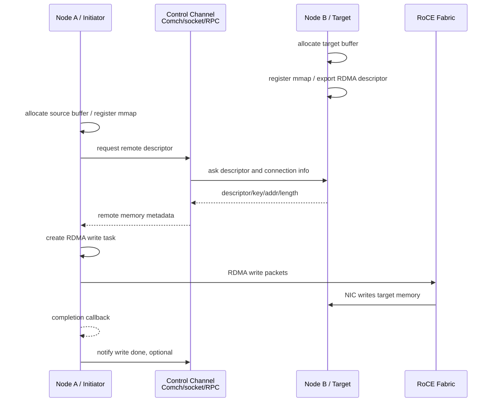

# 08. DOCA RDMA 与 RoCE：远端内存访问

## 1. RDMA 是什么

RDMA 是 Remote Direct Memory Access，允许一台机器通过支持 RDMA 的网卡/NIC/DPU 直接访问另一台机器已注册的内存区域，尽量绕过远端 CPU 的数据拷贝路径。

常见操作：

- send / receive；
- read：本端从远端内存读；
- write：本端写入远端内存；
- write with immediate；
- atomic compare-and-swap；
- atomic fetch-and-add。

DOCA RDMA 把这些能力放进 DOCA 的 device、mmap、buf、ctx、task、PE 模型中。

## 2. RoCE 是什么

RoCE 是 RDMA over Converged Ethernet，即在以太网上运行 RDMA。

NVIDIA 官方 RoCE 文档强调的关键点包括：

- RoCEv1 与 RoCEv2；
- GID table；
- QP 的 RoCE mode；
- RDMA CM 应用的 RoCE mode；
- VLAN、优先级、PFC/ECN 等网络配置对可靠性的影响。

实际生产中，RoCE 是否稳定，强依赖交换机、网卡、固件、QoS、PFC/ECN、MTU、拥塞控制配置。

## 3. DOCA RDMA 架构



## 4. RDMA 的两个核心前提

### 4.1 能力支持

能力查询回答：

> 当前设备/固件/驱动/模式是否支持目标 RDMA task？限制是多少？

例如：

- 是否支持 send/recv/read/write/atomic；
- 最大 task 数；
- buffer list 限制；
- 是否支持 DPA/GPU datapath；
- 多连接能力。

### 4.2 内存注册与授权

内存注册/导出回答：

> 哪段内存可以被哪个本地/远端 device 访问？远端需要什么 descriptor/key？

RDMA read/write 不是随便读写远端任意地址。远端必须：

1. 注册内存；
2. 导出或交换 remote descriptor/key；
3. 通过控制通道把元数据给本端；
4. 在生命周期内保持内存有效；
5. 按权限允许 read/write/atomic。

## 5. RDMA 连接与元数据交换

DOCA RDMA 可能使用 export/connect 或 RDMA CM 等连接流程。无论具体 API，逻辑上都需要交换：

- 本端/远端设备或地址信息；
- queue pair 或连接信息；
- memory export descriptor；
- buffer offset/length；
- 权限与版本；
- 错误处理与断开流程。

控制通道可以是：

- DOCA Comch；
- TCP socket；
- gRPC；
- RDMA CM；
- 其他自定义 RPC。

## 6. DOCA RDMA 常见 API/对象

官方 DOCA RDMA 文档覆盖：

- `doca_rdma` 模块对象；
- `doca_rdma_as_ctx()`；
- `doca_rdma_export()`；
- `doca_rdma_connect()`；
- `doca_rdma_addr_create/destroy`；
- `doca_rdma_connect_to_addr`；
- `doca_rdma_start_listen_to_port`；
- connection accept/reject/disconnect callbacks；
- `doca_mmap_export_rdma`；
- receive/send/send_imm/read/write/write_imm/atomic task 配置；
- `doca_pe_progress()`。

具体函数签名请以目标 DOCA 版本头文件为准。

## 7. RDMA write 示例流程



## 8. send/recv 与 read/write 的区别

| 模式 | 远端 CPU 是否预先参与 | 用途 |
|---|---|---|
| send/recv | 远端需要 post receive 或准备接收 | 消息通知、小数据、控制/数据混合 |
| write | 远端预注册内存后，数据直接写入 | 单向推送数据，远端可少参与 |
| read | 本端主动从远端已注册内存拉取 | 拉取远端 buffer、存储读 |
| atomic | 对远端内存做原子操作 | 分布式同步/计数，使用要谨慎 |

## 9. RDMA 与存储

在 DOCA 存储场景中，RDMA 常出现在：

- NVMe-oF backend；
- DPU 作为 initiator/target；
- Host 前端请求由 DPU 侧转为 RDMA 访问远端存储；
- Comch 负责交换控制元数据，RDMA 负责数据搬运；
- DMA 负责 Host↔DPU buffer 搬运，RDMA 负责 DPU↔remote 搬运。



## 10. RoCE 调试清单

RDMA 问题经常不是代码本身，而是环境。检查：

```bash
# RDMA 设备与网口映射
ibdev2netdev

# GID table
show_gids

# 链路状态、MTU
ip link show

# RDMA device 信息
rdma link
rdma dev

# 基础连通性
ping <peer-ip>

# 如果安装了 perftest，可用 ib_write_bw/ib_read_bw/ib_send_bw 做基线
ib_write_bw <peer>
```

还要确认：

- 两端 RoCE mode 一致；
- GID index 选择正确；
- MTU 匹配；
- 交换机 PFC/ECN 配置；
- 防火墙/路由/VLAN；
- 固件/驱动版本兼容；
- RDMA CM 使用的 IP 与 netdev 正确。

## 11. 常见坑

1. 以为 RDMA 可以读写任意远端地址；实际必须注册并授权。
2. 只交换了地址，没交换 rkey/descriptor/length/权限。
3. memory lifetime 不足，远端还在访问就释放。
4. Completion 只说明本端语义完成，不等于应用层已经消费。
5. RoCE 网络没配好，表现为超时、丢包、性能抖动。
6. 没有区分 RDMA CM 连接管理和 DOCA RDMA task 执行。
7. 没有用 `doca_caps` 确认目标 task 是否支持。

## 技术细节补充：RDMA/RoCE 必备名词

| 名词 | 解释 | 为什么重要 |
|---|---|---|
| QP | Queue Pair，RDMA 操作队列。 | QP 状态、数量、path MTU、retry 影响连接和性能。 |
| CQ | Completion Queue，完成事件队列。 | poll/interrupt/moderation 影响延迟与 CPU。 |
| MR | Memory Region，注册后的内存区域。 | 只有 MR 覆盖的内存才能被 RDMA 访问。 |
| lkey/rkey | 本地/远端访问 key。 | rkey 泄露会带来远端内存访问风险。 |
| GID | RoCE 地址标识。 | GID index 错会导致连接失败或走错 VLAN/IP。 |
| RC/UC/UD | RDMA 传输类型。 | 可靠性、连接、消息语义不同；常见可靠读写关注 RC。 |
| RDMA CM | RDMA connection manager。 | 用 IP/端口建立 RDMA 连接时常涉及。 |
| PFC/ECN/DCQCN | 以太网无损/拥塞控制机制。 | RoCE 生产稳定性核心。 |

### 内存授权语义

RDMA read/write 的安全边界主要来自内存注册和 key：

1. 远端注册一段内存，得到访问描述符/key；
2. 远端通过控制通道把 descriptor/key/addr/len 给本端；
3. 本端只能在授权范围内访问；
4. 远端撤销或释放后，本端继续访问应失败或产生未定义风险；
5. 因此 descriptor 的生命周期、权限和日志脱敏非常重要。

## 性能/调优视角

- **RoCE 先行**：先用 `ib_write_bw`/`ib_read_bw`/`ib_send_bw` 或平台工具跑通基线，再看 DOCA RDMA。
- **MTU/GID/PFC/ECN**：这些环境项错一个，代码再正确也会 timeout、retry 或抖动。
- **MR 复用**：内存注册是昂贵操作，连接生命周期内复用 MR/mmap。
- **Queue depth**：提高 outstanding ops 可提升吞吐，但过高会增加尾延迟和内存压力。
- **CQ moderation**：合并 completion 降低 CPU，但增加延迟；按 workload 选择。
- **NUMA/CPU affinity**：RDMA poll thread、内存、NIC 所在 NUMA 节点要匹配。
- **小消息优化**：小 send 可考虑 inline，但受硬件和 API 限制，必须测。

## 开发中常见问题

| 现象 | 可能原因 | 排查顺序 |
|---|---|---|
| 连接超时 | IP/GID/路由/VLAN/PFC/RDMA CM 错 | ping → ibdev2netdev → show_gids → perftest |
| remote access error | rkey/descriptor/长度/权限错误 | 打印 descriptor 元数据，校验内存生命周期 |
| 性能抖动 | RoCE 拥塞、PFC 配置、CPU 抢占 | 看交换机计数、retry、ECN、CPU pinning |
| 完成语义误解 | RDMA completion 不等于远端应用处理完成 | 增加应用层 ack 或 sync event |
| 内存泄露 | QP/MR/addr/ctx stop 错误路径未释放 | 统一状态机和 cleanup 标签 |
| 多连接崩溃 | 共享对象线程安全或资源上限 | 每连接资源隔离，初始化时读取 max limits |

## 12. 学完本章应该记住

1. DOCA RDMA 是远端内存访问能力在 DOCA task/PE 模型中的封装。
2. RDMA 的核心是连接信息交换 + 内存注册/导出 + 异步任务提交。
3. Comch/socket/RPC 常用于交换 RDMA 元数据；数据本身走 RDMA/RoCE。
4. RoCE 环境配置对可用性和性能影响极大。
5. 存储场景常把 DMA 和 RDMA 组合：Host↔DPU 用 DMA/PCIe，DPU↔Remote 用 RDMA/RoCE。

## 13. 下一步

继续阅读：[09. DOCA 存储、SNAP、NVMe/virtio](09-storage-snap-nvme-virtio.md)。
