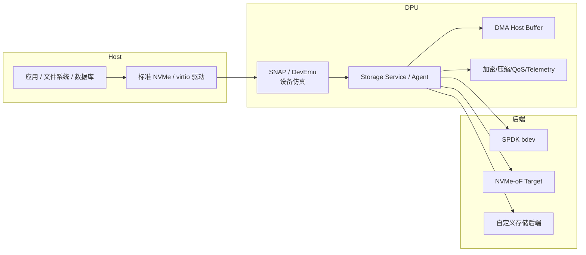
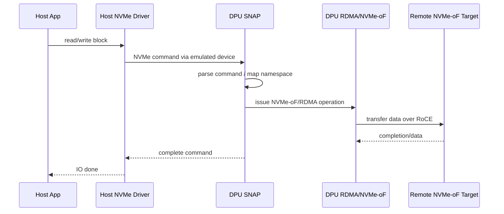
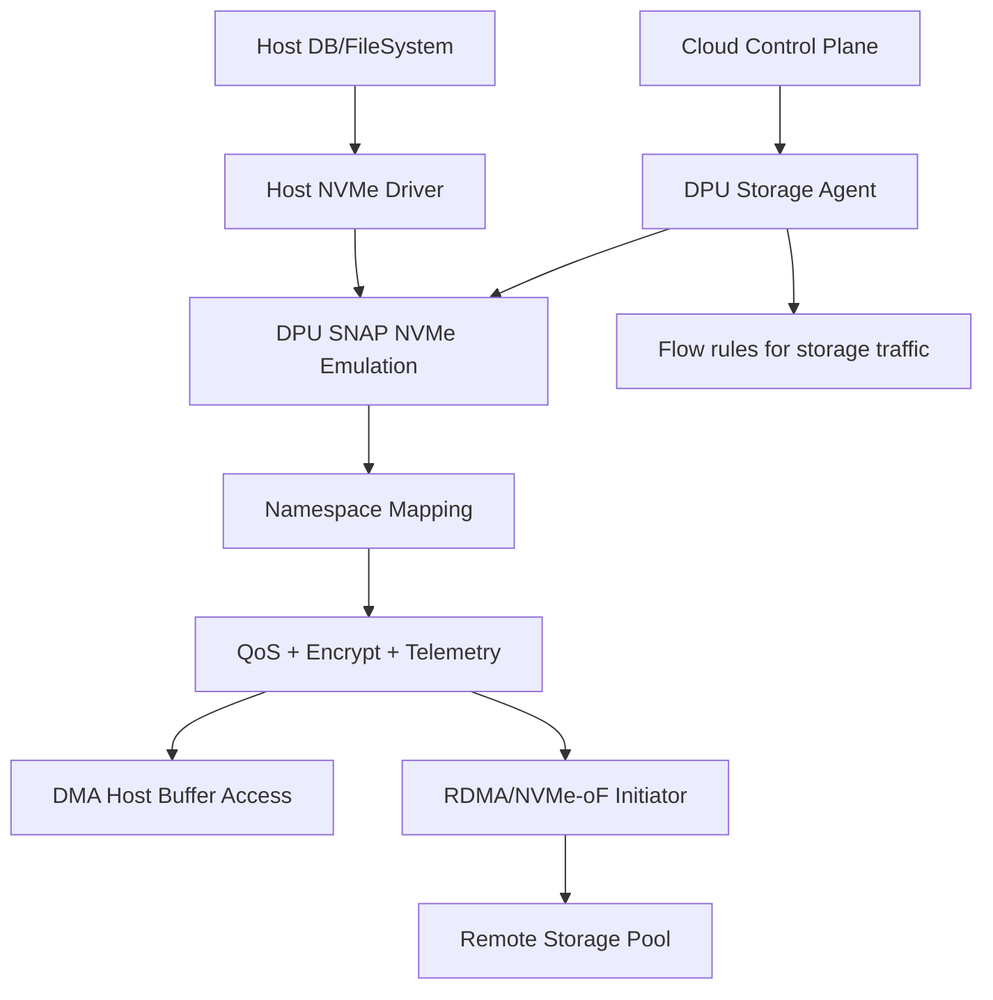

# 09. DOCA 存储：SNAP、NVMe、virtio 与后端数据路径

## 1. DOCA 在存储里的位置

DOCA 不是一个普通文件系统，也不是单纯的磁盘驱动。它在存储方向的核心价值是：

- 在 DPU 侧做存储虚拟化；
- 向 Host 暴露标准 PCIe/NVMe/virtio 设备；
- 在 DPU 侧把请求转发到 SPDK、本地盘、远端 NVMe-oF/RDMA 或自定义后端；
- 在路径中插入加密、压缩、QoS、telemetry、隔离策略。

## 2. SNAP 心智模型

SNAP 可以理解为 DPU 上的存储设备仿真/转发服务。

Host 看到的是标准设备；DPU 侧决定这个设备背后的真实实现。

## 3. 为什么 Host 用标准驱动很重要

如果 Host 看到标准 NVMe/virtio 设备：

- 业务应用无需链接 DOCA；
- OS、文件系统、数据库无需理解 DPU 后端；
- 可以把基础设施复杂度封装在 DPU；
- 便于云平台多租户交付“虚拟磁盘”。

这与云盘/EBS/虚拟块设备的思路类似，只是数据路径和控制点在 DPU/SuperNIC 上。

## 4. 数据路径分层

| 段 | 典型技术 | 说明 |
|---|---|---|
| Host App → Host Driver | Linux block/NVMe/virtio stack | 应用发起普通 IO |
| Host Driver → DPU Emulation | PCIe queue/device emulation | Host 认为自己在访问本地设备 |
| DPU Emulation → Host buffer | DMA | 读写 Host 内存 buffer |
| DPU Agent → Remote backend | RDMA / NVMe-oF / TCP / custom | 访问后端存储 |
| DPU Agent 内部 | SPDK/DOCA service/policy | 调度、QoS、telemetry、加密压缩 |

## 5. NVMe-oF 与 RDMA

NVMe-oF 常把 NVMe 协议跑在 fabrics 上，其中 RDMA 是常见 transport。DOCA 存储场景中可能出现：

- Host 看到本地 NVMe；
- DPU SNAP 接收 Host NVMe queue 请求；
- DPU 侧作为 NVMe-oF initiator 访问远端 target；
- 数据通过 RDMA/RoCE 在 DPU 与远端存储之间搬运；
- Host buffer 与 DPU 之间使用 DMA/PCIe 访问。

## 6. virtio-blk / virtio-fs

virtio 方向关注虚拟化友好设备：

- virtio-blk：块设备；
- virtio-fs：文件系统共享；
- virtio-net：网络设备虚拟化方向也与 DPU 相关。

DOCA DevEmu / SNAP virtio-fs 相关文档覆盖这类服务。它们的共同点是：Host 使用标准 virtio 前端，DPU 侧负责后端实现与数据路径优化。

## 7. 后端共享与一致性

一个容易忽略的问题：后端存储资源并不因为 DPU/SNAP 存在就自动可安全共享。

需要明确：

- 一个 namespace 是否能挂到多个 controller；
- 多写者如何处理一致性；
- 是否需要 reservation、multipath、clustered FS、锁或后端协议；
- SPDK bdev 是否支持多 client 语义；
- cache 是否有一致性协议；
- 断电/重启/失败恢复如何处理。

不要把“DPU 能转发 IO”误解成“后端可以任意共享”。

## 8. 与 Flow/DMA/RDMA/Comch 的组合

存储系统通常是多模块组合：

| 模块 | 在存储路径中的作用 |
|---|---|
| Comch | Host/DPU 控制面，创建/删除设备、交换配置、上报状态 |
| DMA | Host buffer 与 DPU/设备可访问内存之间搬运 |
| RDMA | DPU 与远端存储 target 之间高性能数据传输 |
| Flow | 对存储网络流量进行 steering、隔离、计数、QoS 前置 |
| SNAP/DevEmu | 向 Host 暴露标准设备，处理队列/命令/namespace |
| Telemetry | IOPS、latency、错误、队列、后端状态观测 |

## 9. 一个端到端设计例子

需求：为 Host 提供一块虚拟 NVMe 云盘，后端是远端 RDMA 存储池。

设计：

关键问题：

- namespace 生命周期如何管理；
- Host crash/DPU restart 后如何恢复；
- 后端连接断开怎么处理；
- RDMA 网络 QoS 如何保证；
- 是否需要加密/压缩；
- telemetry 如何暴露给平台。

## 技术细节补充：NVMe/virtio/SNAP 关键名词

| 名词 | 解释 | 设计影响 |
|---|---|---|
| NVMe Controller | Host 看到的 NVMe 控制器对象。 | reset、shutdown、admin command 必须处理。 |
| Namespace | NVMe 逻辑存储空间，类似一块盘。 | 多 controller 共享需要 reservation/一致性机制。 |
| SQ/CQ | Submission/Completion Queue。 | queue depth、队列数、CPU 亲和性决定吞吐/延迟。 |
| Doorbell | Host 通知控制器有新命令的机制。 | 高频 doorbell 会影响延迟和 batching 策略。 |
| PRP/SGL | NVMe 描述 Host 数据 buffer 的方式。 | DPU/SNAP 必须正确解析并访问 Host buffer。 |
| Admin queue | 创建/删除/查询 namespace、feature 等管理命令队列。 | 控制面错误会导致 Host 设备不可用。 |
| virtqueue | virtio 的环形队列。 | 与 NVMe SQ/CQ 类似，也有 queue depth 和通知成本。 |
| SPDK bdev | SPDK 块设备抽象。 | 后端性能、一致性和多消费者语义取决于 bdev 类型。 |

### SNAP 不是一致性协议

SNAP 能把设备暴露给 Host，并把 IO 转发到后端；但以下问题仍要应用/平台设计：

- 多 Host 是否能同时写同一 namespace；
- 是否需要 NVMe reservation 或集群文件系统；
- flush、FUA、write barrier 如何映射到后端；
- DPU reboot 后 Host 队列如何恢复；
- 后端断连时 Host 应看到什么错误；
- cache 在 Host、DPU、backend 多层之间如何保持一致。

## 性能/调优视角

- **分段测基线**：先测后端 SPDK/NVMe-oF，再测 DPU 转发，再测 Host 看到的块设备。
- **queue depth 与队列数**：低 QD 看延迟，高 QD 看吞吐；多队列要配 CPU affinity。
- **IO size 分类**：4K random、64K sequential、混合读写要分开测。
- **zero-copy 优先**：减少 Host buffer、DPU buffer、backend buffer 之间多余 copy。
- **SPDK reactor**：如果后端是 SPDK，关注 reactor core pinning、hugepage、bdev 配置。
- **RDMA transport**：NVMe-oF/RDMA 后端先确保 RoCE 无 retry/无明显拥塞。
- **completion batching**：批量完成可提升 IOPS，但可能增加 p99。

## 开发中常见问题

| 现象 | 可能原因 | 建议 |
|---|---|---|
| Host 看到盘但 IO 卡住 | queue/reset/admin command 状态机不完整 | 先跑官方 SNAP/NVMe sample，抓 admin command 流程 |
| 写入后数据不一致 | flush/FUA/cache/order 未正确映射 | 明确定义持久化语义并测试断电/重启场景 |
| 多主机写坏数据 | 缺少 reservation/锁/集群 FS | 不要把 raw namespace 随意多写共享 |
| 性能低 | backend 慢、copy 多、QD 低、NUMA 错 | 分段压测定位瓶颈 |
| reset 后资源残留 | Host reset 与 DPU resource registry 脱节 | controller/namespace/queue 全部状态化、幂等 cleanup |

## 10. 学完本章应该记住

1. DOCA 存储重点不是文件系统，而是 DPU 侧设备仿真、存储虚拟化与数据路径加速。
2. Host 通常使用标准 NVMe/virtio 驱动，DPU 侧隐藏后端复杂度。
3. DMA 负责 Host↔DPU buffer 访问，RDMA/NVMe-oF 负责 DPU↔远端存储传输。
4. 后端共享和一致性需要单独设计，不能假设 SNAP 自动解决。
5. 存储方向通常要把 SNAP、DMA、RDMA、Flow、Telemetry 一起考虑。

## 11. 下一步

继续阅读：[10. 安全、加密、遥测与运维工具](10-security-crypto-telemetry-ops.md)。
