# 10. 安全、加密、遥测与运维工具

## 1. 为什么安全和观测在 DOCA 中重要

DPU/SuperNIC 位于 Host 与网络/存储之间，是天然的基础设施边界。DOCA 不只提供数据面加速，也提供安全、加密、压缩、遥测、诊断工具，让基础设施逻辑可以放在 Host 外部执行与观测。

## 2. 安全隔离场景

典型目标：

- Host 业务进程被攻破后，基础设施策略仍由 DPU 控制；
- 租户流量进入 Host 前已被 ACL/安全组过滤；
- 存储 IO 在 DPU 侧加密/解密；
- DPU agent 独立采集 VM/进程/网络行为；
- 控制面请求需要权限校验和审计。



## 3. DOCA App Shield

DOCA App Shield 面向主机/应用监控和安全场景。学习时重点理解它的位置：

- 它不是业务应用内部 SDK；
- 它更接近从 DPU/外部视角观察 Host；
- 可用于安全监控、完整性检查、威胁检测类场景；
- 具体能力、平台支持和部署方式需查官方 App Shield 文档。

## 4. 加密、摘要、压缩、纠删码

DOCA 文档中可见的相关库包括：

- DOCA AES-GCM；
- DOCA SHA；
- DOCA Compress；
- DOCA Erasure Coding；
- 其他安全/数据处理能力视版本和硬件支持而定。

它们通常也遵循 DOCA task 模型：

1. 查询设备能力；
2. 创建模块对象；
3. 准备 mmap/buf；
4. 配置 task callback；
5. 提交 encrypt/decrypt/hash/compress 等 task；
6. 通过 PE 推进和处理 completion。

## 5. 在网络/存储路径中插入加密

### 5.1 网络方向



### 5.2 存储方向


关键设计点：

- key 管理在哪里；
- DPU agent 如何安全获取密钥；
- 加密发生在 Host buffer、DPU buffer 还是后端 buffer；
- completion 与错误如何回传；
- 是否影响 zero-copy；
- telemetry 中不能泄露敏感信息。

## 6. Telemetry

DOCA Telemetry 相关组件用于采集、导出和诊断指标。对生产系统来说，telemetry 不是附加项，而是必需品。

建议观测维度：

| 层级 | 指标 |
|---|---|
| Flow | pipe/entry hit count、bytes、drop、miss、aging |
| DMA/RDMA | task latency、success/error、queue depth、retry、disconnect |
| Storage | IOPS、bandwidth、latency、namespace、backend error |
| Security | allow/deny count、policy version、异常事件 |
| System | DPU CPU/memory、NIC port、link、firmware、temperature |

## 7. doca_caps：能力探测工具

官方 Capabilities Print Tool 页面给出了常用命令：

```bash
# 列出 DOCA-capable 设备
/opt/mellanox/doca/tools/doca_caps --list-devs

# 列出 representor 设备
/opt/mellanox/doca/tools/doca_caps --list-rep-devs

# 列出安装的 DOCA libraries
/opt/mellanox/doca/tools/doca_caps --list-libs

# 打印能力
/opt/mellanox/doca/tools/doca_caps

# 列出 loggers
/opt/mellanox/doca/tools/doca_caps --list-loggers
```

典型输出会包含：

- PCI 地址；
- ibdev_name；
- iface_name；
- PF/VF 类型；
- MAC/IP；
- 每个 library 的 installed 状态；
- 每个 task 的 supported/unsupported；
- max buffer size、max tasks 等限制。

## 8. Flow Inspector

DOCA Flow Inspector Service 可用于导出/检查 flow pipeline。学习 Flow 时建议形成习惯：

1. 每个实验先画出预期 pipeline；
2. 下发规则后导出实际 pipeline；
3. 对比 pipe/entry/action/miss 是否符合预期；
4. 用 counter 验证实际命中。

## 9. 日志与错误处理

DOCA Log 提供日志后端。建议：

- 每个控制面请求带 request_id；
- 每个资源带 owner/tenant/resource_id；
- task callback 中记录错误码和上下文；
- start/stop/reset 都要记录状态迁移；
- 高速路径不要过度打日志，避免影响性能；
- 敏感数据不写日志。

## 10. 运维 Runbook 模板

当 DOCA 应用异常时，按顺序检查：

```bash
# 1. 硬件/PCI 是否存在
lspci | grep -i mell

# 2. 网络/RDMA 设备映射
ibdev2netdev
rdma link

# 3. DOCA 设备与库
/opt/mellanox/doca/tools/doca_caps --list-devs
/opt/mellanox/doca/tools/doca_caps --list-libs

# 4. 目标能力是否支持
/opt/mellanox/doca/tools/doca_caps

# 5. 链路/IP/MTU
ip link show
ip addr show

# 6. 应用日志
journalctl -u <your-doca-service> -n 200 --no-pager
```

## 技术细节补充：安全/数据处理名词

| 名词 | 解释 | 注意事项 |
|---|---|---|
| AES-GCM | 认证加密模式，输出 ciphertext 和 authentication tag。 | nonce/IV 不能在同一 key 下重复；tag 校验失败必须拒绝数据。 |
| AAD | Additional Authenticated Data，只认证不加密的附加数据。 | 适合放 tenant、header、版本等元数据。 |
| SHA | 哈希摘要算法，用于完整性校验等。 | 不是加密，不提供保密性。 |
| Compress | 压缩/解压数据块。 | 小块或不可压缩数据可能负收益。 |
| Erasure Coding | 纠删码，用冗余分片提供容错。 | 编码参数影响存储开销、恢复成本和延迟。 |
| App Shield | 从 DPU/外部视角做 Host/应用安全监控的能力。 | 具体可见性和平台支持以官方文档为准。 |
| Telemetry | 指标/事件/统计导出。 | 高基数和高频采样会影响系统本身。 |
| Flow Inspector | 导出/检查 DOCA Flow pipeline 的服务。 | 用于验证规则是否按预期安装。 |

## 性能/调优视角

- 加密/压缩/纠删码适合批量和较大数据块；小块高频请求要测提交成本。
- AES-GCM 要把 key/nonce/tag/AAD 生命周期设计清楚，不能为了性能复用 nonce。
- 压缩要先测数据集压缩率；不可压缩数据会浪费 CPU/加速器时间。
- Telemetry 要分层聚合：高速路径计数器优先，详细日志采样输出。
- Flow counter 和 telemetry label 不要无限细分，否则会消耗硬件资源和监控系统资源。
- 安全日志要脱敏：rkey、token、密钥、完整内存地址不要原样输出。

## 开发中常见问题

| 问题 | 后果 | 处理 |
|---|---|---|
| AES-GCM nonce 重复 | 破坏安全性 | key/nonce 管理由专门模块负责，持久化计数或随机策略要可证明 |
| tag 校验失败仍使用明文 | 数据被篡改仍进入业务 | tag fail 走硬错误路径，记录审计 |
| telemetry 太细 | 监控系统爆炸，业务抖动 | 控制 label cardinality，聚合/采样 |
| DPU agent 权限过大 | Host client 可越权操作资源 | 所有控制面请求做 tenant/resource 校验 |
| 日志过多 | fast path 变慢 | 高速路径只计数，错误路径限速日志 |
| Flow Inspector 只在故障后使用 | 平时无基线 | 每次规则变更可导出摘要，形成对比基线 |

## 11. 学完本章应该记住

1. DPU 是安全与基础设施隔离边界，DOCA 能把策略执行从 Host 移出去。
2. crypto/compress/erasure coding 等库通常也遵循能力查询 + mmap/buf + task + PE 模型。
3. Telemetry、counter、Flow Inspector 是生产可用性的关键。
4. `doca_caps` 是排查能力不匹配的第一工具。
5. 安全设计必须覆盖控制面认证、资源归属、密钥管理、日志脱敏和失败恢复。

## 12. 下一步

继续阅读：[11. 从零实操：Quick Start 与第一个参考应用](11-hands-on-quickstart-and-first-app.md)。
