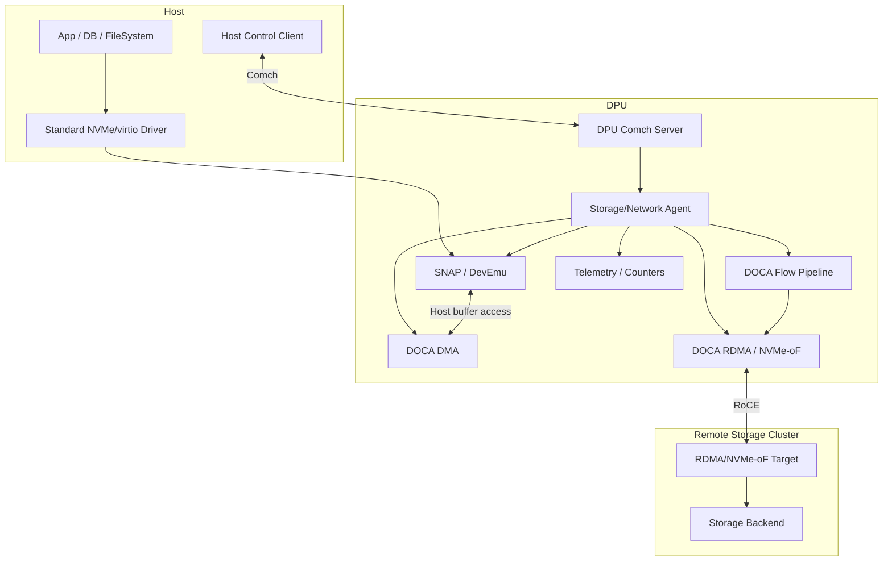
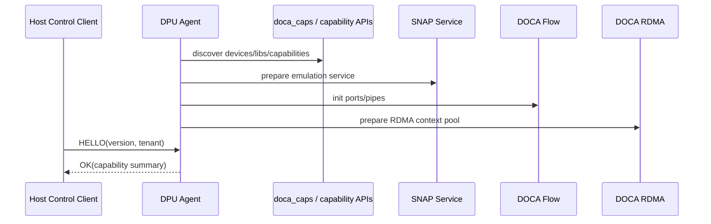
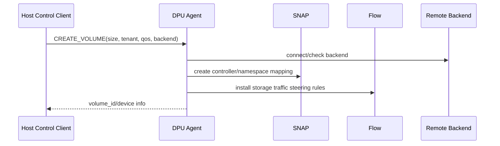
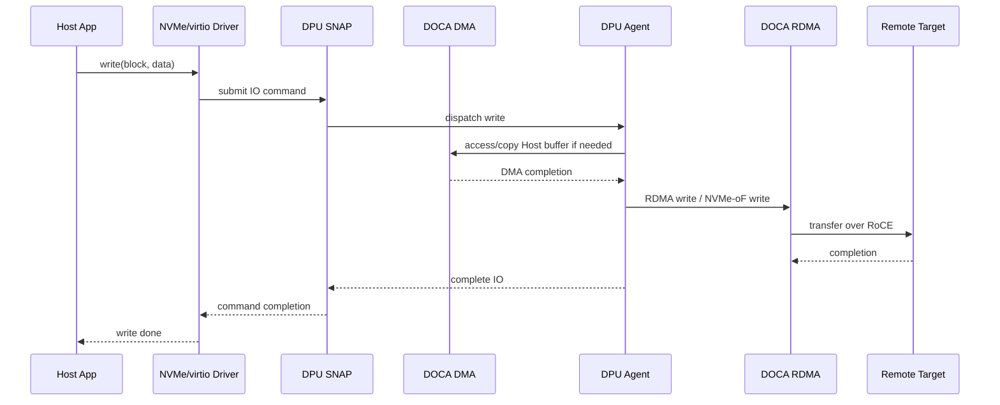
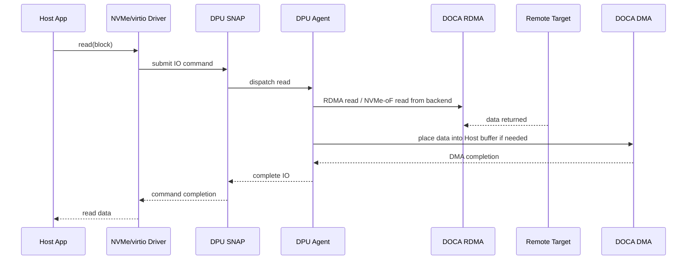
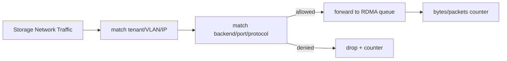

# 12. 综合设计：Comch + Flow + DMA/RDMA + Storage 原型

## 1. 目标

本章把前面学过的模块组合起来，设计一个学习型端到端原型：

> Host 上的应用访问一块虚拟存储设备；DPU 侧负责设备仿真、策略控制、Host buffer 访问、远端 RDMA 后端访问、网络流量 steering 和 telemetry。

这个设计不是直接可复制的生产代码，而是帮助你理解 DOCA 各模块如何在真实系统中协作。

## 2. 总体架构

## 3. 控制面流程

### 3.1 初始化

### 3.2 创建虚拟卷

### 3.3 删除/恢复

删除时必须：

1. 停止 Host 新 IO；
2. flush pending IO；
3. 删除或 detach namespace；
4. 断开 RDMA/backend 连接；
5. 删除 Flow entries；
6. 回收 DMA/RDMA/mmap/buf 资源；
7. 删除控制面 resource registry。

## 4. 数据面读写流程

### 4.1 写路径

### 4.2 读路径

## 5. Flow 在这个设计中做什么

Flow 不直接理解“文件”或“块设备”，它负责网络 steering 与策略：

- 把存储后端流量 steering 到正确 queue；
- 按 tenant/backend/port 做 ACL；
- 对 RDMA/NVMe-oF 流量计数；
- drop 非法来源；
- 给 telemetry 提供 counter；
- 在多 backend 时做分类。

示意：

## 6. Comch 在这个设计中做什么

Comch 负责控制面：

- Host client 与 DPU agent 版本协商；
- 创建/删除 volume；
- 查询状态；
- 下发 QoS/ACL；
- 交换 RDMA/backend metadata；
- 触发故障恢复；
- 读取 counters/telemetry 摘要。

不要用 Comch 搬大块 IO 数据。大块数据应走 DMA/RDMA/设备队列。

## 7. DMA/RDMA 分工

| 段 | 推荐能力 |
|---|---|
| Host buffer ↔ DPU/设备可访问 memory | DMA / PCIe / SNAP 相关机制 |
| DPU ↔ remote storage node | RDMA / NVMe-oF / RoCE |
| 控制信息交换 | Comch / socket / RPC |
| 网络包 steering | Flow |

## 8. 最小可行原型拆分

不要一口气做完整系统。推荐阶段：

### Phase 1：只跑官方 sample 与能力探测

- `doca_caps --list-devs`；
- `doca_caps --list-libs`；
- Secure Channel reference app；
- 记录版本和 PCI 地址。

### Phase 2：Comch hello

- Host client ↔ DPU server；
- HELLO/OK 协议；
- request_id 与错误码；
- 断开重连。

### Phase 3：DMA local copy

- 单端 local copy；
- 校验 buffer；
- 多 task；
- 错误处理。

### Phase 4：RDMA write/read

- 两节点 RoCE 基线；
- 交换 descriptor；
- RDMA write；
- RDMA read；
- 断链恢复。

### Phase 5：Flow ACL

- 创建 port/pipe/entry；
- allow/drop；
- counter；
- Flow Inspector。

### Phase 6：Storage mock

- 先不接 SNAP，用用户态 mock IO 请求；
- Comch 创建 volume；
- RDMA 后端读写；
- telemetry 输出。

### Phase 7：接 SNAP/DevEmu

- 暴露标准设备；
- 处理真实 Host IO；
- 完成端到端读写。

## 9. 生产化必须补齐的问题

| 主题 | 必须回答 |
|---|---|
| 故障恢复 | DPU reboot、Host reboot、backend disconnect 后资源如何重建？ |
| 一致性 | 多 writer、cache、flush、barrier、reservation 如何处理？ |
| 安全 | Host client 身份、tenant 隔离、权限、密钥如何管理？ |
| 性能 | queue depth、batch、NUMA、MTU、PFC/ECN、CPU pinning 如何调优？ |
| 可观测性 | 每层 latency/counter/error 如何导出？ |
| 升级 | DOCA/firmware/service/API 版本如何兼容？ |
| 回滚 | 新 DPU agent 失败后如何恢复旧版本？ |

## 技术细节补充：端到端系统需要资源注册表

一旦组合 Comch、Flow、DMA、RDMA、SNAP，就必须有统一 resource registry。建议每个资源至少记录：

| 字段 | 说明 |
|---|---|
| resource_id | 全局唯一 ID，控制面返回给 Host/client |
| owner | tenant、client connection、权限域 |
| type | flow_entry、rdma_conn、mmap、volume、namespace、queue 等 |
| state | creating、ready、draining、deleting、error、recovering |
| dependencies | 依赖哪些 device、ctx、mmap、QP、Flow entry、backend |
| generation | 防止旧请求误操作新资源 |
| cleanup policy | 断连、超时、DPU restart 时如何处理 |

### 失败域分解

| 失败域 | 例子 | 处理原则 |
|---|---|---|
| Host | client crash、VM reset、driver reset | DPU 资源按 owner 清理或进入 orphan 状态 |
| DPU agent | 进程重启、DPU reboot | 资源可重建，控制面状态可恢复 |
| Network | RoCE 拥塞、链路 flap | RDMA reconnect，Flow 降级/阻断 |
| Backend | 存储 target down、超时 | IO 返回明确错误，避免无限挂起 |
| Control plane | Comch 断开、版本不匹配 | heartbeat、重连、协议协商 |

## 性能/调优视角

- **端到端 pipeline 并行**：Host queue、DPU DMA、RDMA backend、completion 处理应并行，不要串行等待每一步。
- **分层 queue depth**：Host NVMe QD、DPU 内部队列、RDMA QD、后端 QD 要协同，某一层太低会限制整体吞吐。
- **预创建资源池**：常用 Flow pipe、RDMA connection pool、mmap/buf pool 可预热，减少 cold path 延迟。
- **背压传播**：后端慢时要向上游限流，避免 DPU 内存堆积。
- **观测分层**：每个请求记录 Host enqueue、DPU receive、DMA done、RDMA done、backend done、Host complete 时间点。
- **故障演练**：压测不只跑 happy path，还要重启 DPU agent、断 backend、断 RoCE、Host reset。

## 开发中常见问题

| 问题 | 表现 | 修复方向 |
|---|---|---|
| 模块各自可跑，组合失败 | 生命周期和依赖没统一 | resource registry + 状态机 |
| 局部 completion 后过早返回 | 上层语义未完成 | 明确定义每层 completion 语义 |
| 失败后无法重试 | 操作非幂等或资源 ID 混乱 | request_id、generation、idempotency key |
| 性能瓶颈找不到 | 缺少分层时间戳 | 每层打点并导出 telemetry |
| 安全越权 | Host client 可操作其他 tenant 资源 | DPU agent 做强校验，不信任 Host 请求 |
| 升级困难 | Host/DPU 协议耦合 | feature bitmap、版本协商、灰度/回滚策略 |

## 10. 学完本章应该记住

1. 真实 DOCA 应用通常是多个模块组合，而不是单库单函数。
2. Comch 传控制，Flow 管网络 fast path，DMA/RDMA 搬数据，SNAP/DevEmu 暴露设备，Telemetry 负责观测。
3. Host/DPU/Remote 三端的资源生命周期必须统一管理。
4. 先分阶段验证每个最小闭环，再组合端到端系统。
5. 生产化重点不是“能跑一次”，而是故障恢复、一致性、安全、观测和升级。

## 11. 后续练习

继续阅读：[13. 性能调优与开发排障手册](13-performance-tuning-and-troubleshooting.md)，并在需要查概念时参考：[98. DOCA 技术术语表](98-technical-glossary.md)。

尝试为自己的场景写一份设计文档，包含：

- 目标场景：网络/存储/安全/AI 集群？
- Host 侧组件；
- DPU 侧 agent/service；
- 使用哪些 DOCA 模块；
- 控制面协议；
- 数据面路径；
- failure mode；
- 用 `doca_caps` 证明目标能力存在。
