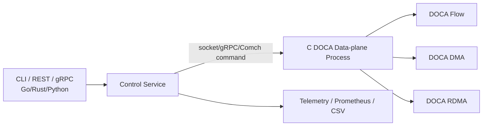

# 14. DOCA 代码实验语言选择与项目布局

本章回答一个实践问题：DOCA 代码实验到底应该用什么语言写、怎么组织目录、怎么从学习实验演进到可维护的控制面/数据面原型。

结论先行：

> **DOCA 学习实验主语言用 C；Python 做自动化和结果分析；等熟悉 DOCA 生命周期后再考虑 C++ 封装；Rust/Go 暂时更适合外围控制面，不建议一开始直接 FFI 绑定 DOCA。**

## 1. 为什么主语言推荐 C

DOCA 官方 SDK 以 C API 为核心，官方 sample/reference app 也最接近 C 生态。学习阶段最重要的是看清 DOCA 对象和生命周期，而不是先设计语言封装。

DOCA 核心对象本身就是 C 风格：

```text
doca_devinfo -> doca_dev
module object -> doca_ctx
memory -> doca_mmap -> doca_buf_inventory -> doca_buf
doca_task -> doca_pe_progress() -> callback
```

如果一开始用 C++/Rust/Go 包一层，会引入额外问题：

- wrapper 的生命周期是否正确；
- FFI callback 是否安全；
- buffer ownership 是否和 DOCA mmap 一致；
- 错误来自 DOCA、语言绑定还是封装层；
- 与官方 sample 对照困难。

学习阶段优先目标是：

1. 能打开正确的 device/representor；
2. 能完成 capability query；
3. 能创建 mmap/buf；
4. 能配置 ctx/task/callback；
5. 能 progress PE；
6. 能正确 cleanup。

这些用 C 最直接。

## 2. 语言分层建议

| 层级 | 推荐语言 | 适合内容 | 不适合内容 |
|---|---|---|---|
| DOCA 数据面实验 | C | Flow、DMA、RDMA、Comch、SNAP mock、crypto task | 复杂 Web/API 控制面 |
| 编译系统 | Makefile / CMake | 最小 sample、链接 DOCA 库、复用官方 flags | 过度复杂的 monorepo 构建 |
| 自动化脚本 | Python | 调 `doca_caps`、跑 benchmark、解析日志、画图 | 直接写高性能 DOCA 数据面 |
| 后期资源封装 | C++ | RAII 管理 `doca_dev/mmap/ctx/task` 生命周期 | 初学阶段直接抽象所有 API |
| 外围控制面 | Go / Rust / Python | REST/gRPC、配置管理、实验调度、Telemetry 收集 | 初期直接 FFI 操作 DOCA |
| DPA / GPUNetIO | C/CUDA/官方工具链 | DPU/GPU 近数据路径开发 | 用通用脚本语言替代官方编译链 |

## 3. 推荐目录布局

建议在 `docatest` 下后续增加 `labs/`，但文档阶段先定义布局，不强行写不可运行代码：

```text
docatest/
  README.md
  doc/
    00-series-index.md
    ...
    14-code-lab-language-and-layout.md
  labs/
    00-hello-log-c/
      README.md
      hello_doca.c
      Makefile
    01-caps-python/
      README.md
      collect_caps.py
      sample-output/
    02-dma-local-copy-c/
      README.md
      main.c
      Makefile
    03-comch-host-dpu-c/
      README.md
      protocol.h
      host_client.c
      dpu_server.c
      Makefile
    04-rdma-write-read-c/
      README.md
      protocol.h
      initiator.c
      target.c
      Makefile
    05-flow-acl-c/
      README.md
      rules.json
      main.c
      Makefile
    06-flow-counter-c/
      README.md
      main.c
      Makefile
    07-storage-mock-c/
      README.md
      protocol.h
      main.c
      Makefile
    scripts/
      check_env.py
      run_bench.py
      parse_caps.py
      plot_results.py
```

## 4. 每个实验目录必须包含什么

每个 lab 都建议包含：

| 文件 | 作用 |
|---|---|
| `README.md` | 实验目标、前置条件、运行命令、预期输出、排障 |
| `ENV.md` 或 `sample-output/` | 记录 DOCA 版本、设备、`doca_caps` 摘要和样例输出 |
| `main.c` / 组件源文件 | 尽量保持短小，突出一个 DOCA 概念 |
| `Makefile` 或 `CMakeLists.txt` | 构建方式透明，优先从官方 sample 借鉴 flags |
| `protocol.h` | Host/DPU 或 RDMA 实验中的消息结构、opcode、错误码 |
| `run.sh` 或 Python runner | 可重复执行实验，避免手工命令散落 |

实验 `README.md` 模板：

```markdown
# Lab: DMA Local Copy

## 目标

验证 DOCA DMA memcpy task 的最小闭环：capability query -> mmap/buf -> submit task -> PE progress -> completion -> 校验数据。

## 前置条件

- DOCA SDK installed
- `doca_caps --list-libs` 显示 dma installed
- 目标 device 支持 DMA memcpy task

## 构建

```bash
make
```

## 运行

```bash
./dma_local_copy --pci-addr <BDF> --size 1048576
```

## 预期输出

- 打印 device/capability 摘要
- task completion success
- src/dst 校验一致

## 常见问题

- `unsupported`: 设备或 task capability 不支持
- no completion: PE 没 progress 或 ctx 未 running
- data mismatch: buffer length、cache/coherency 或生命周期错误
```

## 5. C 实验编写原则

### 5.1 先写显式生命周期，不要过早封装

学习阶段的 C 代码建议显式写出每一步：

```text
parse args
init logging
find device
query capability
open device
create module
convert as ctx
create/connect PE
configure task callback
create/register mmap
create buf inventory
allocate task
submit task
progress PE
cleanup in reverse order
```

不要一开始就写一个很厚的 `doca_utils.c` 把所有细节藏起来。可以在第 3-4 个实验后再提取公共函数。

### 5.2 错误处理用统一出口

C 代码建议使用单一 cleanup path：

```c
int rc = 0;

rc = step1();
if (rc != 0)
    goto destroy_step0;

rc = step2();
if (rc != 0)
    goto destroy_step1;

/* ... */

destroy_step2:
    cleanup_step2();
destroy_step1:
    cleanup_step1();
destroy_step0:
    cleanup_step0();
return rc;
```

原因：DOCA 对象之间有依赖关系，错误路径如果随手 `return`，很容易泄露 mmap、ctx、task、device。

### 5.3 所有实验都打印 capability 摘要

每个 C lab 初始化时打印：

- 选择的 PCI BDF；
- 选择的 ibdev/netdev/representor，如果有；
- 目标 task 是否 supported；
- max task 数；
- max buffer size；
- queue/connection 数量限制；
- 当前运行在 Host 侧还是 DPU 侧。

这样后续比较不同机器/版本时不会迷失。

## 6. Python 应该做什么

Python 不建议直接走 DOCA C API，但非常适合自动化：

```text
scripts/check_env.py
scripts/collect_caps.py
scripts/run_bench.py
scripts/parse_results.py
scripts/plot_results.py
```

### 6.1 `check_env.py`

职责：

- 检查 `/opt/mellanox/doca/tools/doca_caps` 是否存在；
- 执行 `--list-devs`、`--list-libs`；
- 提示用户选择 PCI BDF；
- 生成 `ENV.md`。

### 6.2 `run_bench.py`

职责：

- 对不同 size、queue depth、batch 参数循环运行 C binary；
- 保存 stdout/stderr；
- 提取 throughput、latency、error count；
- 输出 CSV/JSON。

示例参数矩阵：

```text
DMA size: 4K, 64K, 1M, 16M
RDMA message size: 64B, 1K, 4K, 64K, 1M
Queue depth: 1, 4, 16, 64, 256
Flow rules: 1, 1K, 10K, 100K
```

### 6.3 `plot_results.py`

职责：

- 读取 CSV；
- 画 throughput vs size；
- 画 p50/p99 latency；
- 对比 CPU memcpy vs DMA、perftest vs DOCA RDMA、规则数 vs Flow throughput。

## 7. C++ 什么时候引入

当你已经能用 C 跑通以下实验后，可以考虑 C++：

- hello log；
- DMA local copy；
- Comch hello；
- RDMA write/read；
- Flow ACL + counter。

C++ 适合封装资源生命周期：

```cpp
class DocaDevice {
public:
    explicit DocaDevice(const std::string& pci_bdf);
    ~DocaDevice();
    doca_dev* get() const;
};

class DocaMmap {
public:
    DocaMmap(doca_dev* dev, void* addr, size_t len);
    ~DocaMmap();
};
```

引入 C++ 的目标不是“看起来高级”，而是减少 cleanup 错误。每个 wrapper 都必须明确：

- 是否可复制；
- 是否可移动；
- 析构时是否允许仍有 outstanding task；
- callback 中如何引用对象；
- 多线程 owner 是谁。

## 8. Rust/Go 的位置

Rust/Go 不建议一开始直接绑定 DOCA C API，但适合做外围控制面。

推荐架构：



这种模式下：

- C 进程负责 DOCA device/mmap/task/PE；
- Go/Rust/Python 负责配置、API、调度、监控；
- 两者通过明确协议通信；
- 避免一开始处理复杂 FFI 和 callback lifetime。

如果以后一定要做 Rust FFI，需要先补齐：

- bindgen 生成头文件绑定；
- `unsafe` 边界集中封装；
- `doca_mmap` 与 Rust borrow/lifetime 的关系；
- callback 的 `'static` 数据管理；
- panic 不跨 FFI；
- Send/Sync 明确标注，不默认线程安全。

## 9. 编译系统选择

### 9.1 初期：Makefile

每个小实验一个 Makefile，清晰可读。

优点：

- 命令直观；
- 便于根据官方 sample 修改；
- debug 简单；
- 学习成本低。

注意：不要硬编码无法验证的 DOCA include/lib 路径。优先：

```bash
pkg-config --list-all | grep -i doca
```

如果没有 pkg-config，再查官方 sample 或安装路径。

### 9.2 中后期：CMake

当多个 lab 共享 common 工具代码时，再引入 CMake：

```text
labs/
  CMakeLists.txt
  common/
    doca_device.c
    doca_device.h
    logging.c
    logging.h
  02-dma-local-copy-c/
    main.c
```

CMake 适合：

- 统一编译参数；
- 多 target；
- 交叉编译 Host/DPU；
- CI 检查。

## 10. 推荐实验顺序与语言

| 顺序 | 实验 | 语言 | 目标 |
|---|---|---|---|
| 0 | 环境探测 | Python + shell command | 收集 `doca_caps`、设备、库、版本 |
| 1 | Hello DOCA Log | C | 验证头文件、链接、日志 |
| 2 | DMA local copy | C | 掌握 mmap/buf/task/PE |
| 3 | Comch hello | C | 掌握 Host↔DPU 控制消息 |
| 4 | RDMA write/read | C + Python runner | 掌握连接、内存导出、远端访问 |
| 5 | Flow ACL/counter | C | 掌握 pipe/entry/action/counter |
| 6 | Flow + Comch | C | Host 控制 DPU 下发规则 |
| 7 | DMA + RDMA pipeline | C | Host↔DPU↔Remote 数据路径 |
| 8 | Storage mock | C | 模拟 SNAP/后端 IO 生命周期 |
| 9 | Benchmark automation | Python | 批量跑参数、生成图表 |
| 10 | C++ RAII wrapper | C++ | 减少资源生命周期错误 |
| 11 | Go/Rust control plane | Go/Rust/Python | API、配置、Telemetry、实验调度 |

## 11. 性能实验语言边界

性能关键路径必须尽量接近真实数据面：

- Flow/DMA/RDMA/SNAP mock 的 fast path：C；
- benchmark 参数生成：Python；
- 结果聚合和画图：Python；
- 控制面 API：Go/Rust/Python；
- 不要用 Python 循环模拟 fast path 性能。

正确的分工是：

```text
Python 负责“跑很多次”
C 负责“每次跑真实 DOCA fast path”
```

## 12. 开发中常见问题

| 问题 | 原因 | 建议 |
|---|---|---|
| 一开始用 Rust/Go FFI 卡住 | DOCA callback/mmap/task 生命周期复杂 | 先用 C 跑通，再封装 |
| C 代码 cleanup 混乱 | DOCA 对象依赖多 | 统一 cleanup label，画资源依赖图 |
| Makefile 到处复制 | lab 增多后缺少 common | 3-5 个 lab 后提取 common 或 CMake |
| Python 自动化结果不可信 | 没记录环境和参数 | 每次运行保存 ENV、命令、stdout、stderr、CSV |
| 性能测到脚本开销 | Python 在 hot path | C binary 内部计时，Python 只调度 |
| 官方 sample 与自己代码差异大 | 过早抽象 | 先保留与官方 sample 相似结构，再逐步重构 |

## 13. 本项目建议落地方式

当前 `docatest` 仍以文档为主。下一步如果开始写代码，建议按这个原则执行：

1. 先创建 `labs/00-hello-log-c` 和 `labs/01-caps-python`；
2. 每个 lab 都只验证一个概念；
3. 不在没有真实 DOCA 环境时声称性能或 offload 已验证；
4. 所有 PCI 地址、路径、能力都从目标机器探测；
5. 每个 lab 的 README 记录“目标、构建、运行、预期输出、常见问题”；
6. C 代码保持显式生命周期；
7. Python 脚本只做环境探测和批量实验；
8. 等 5 个 C lab 稳定后，再考虑 C++ RAII 封装。

## 14. 下一步

如果要继续补代码实验文档，可以按以下顺序新增：

- [15-lab-00-hello-log-c.md](15-lab-00-hello-log-c.md)
- [16-lab-01-caps-python.md](16-lab-01-caps-python.md)
- [17-lab-02-dma-local-copy-c.md](17-lab-02-dma-local-copy-c.md)
- [18-lab-03-comch-host-dpu-c.md](18-lab-03-comch-host-dpu-c.md)
- [19-lab-04-rdma-write-read-c.md](19-lab-04-rdma-write-read-c.md)
- [20-lab-05-flow-acl-c.md](20-lab-05-flow-acl-c.md)

这些章节已经给出每个 lab 的目标、前置检查、目录结构、实验步骤、构建运行方式、预期输出、调优方向和常见问题。

也可以直接创建 `labs/` 骨架，但在没有目标 DOCA 机器时，应先写 README/模板，不写声称已验证的代码。
