# 20. Lab 05：Flow ACL + Counter（C）

本实验学习 DOCA Flow 的最小网络数据面实验：创建一个 ACL/过滤规则，对命中流量执行 allow/drop，并通过 counter 验证规则是否命中。

官方参考：

- DOCA Flow: <https://docs.nvidia.com/doca/sdk/DOCA-Flow/index.html>
- DOCA Flow Inspector Service Guide: <https://docs.nvidia.com/doca/sdk/DOCA-Flow-Inspector-Service-Guide/index.html>

官方 Flow 文档中包含 hugepage 准备示例：

```bash
echo '1024' | sudo tee -a /sys/kernel/mm/hugepages/hugepages-2048kB/nr_hugepages
sudo mkdir /mnt/huge
sudo mount -t hugetlbfs -o pagesize=2M nodev /mnt/huge
```

请以目标 DOCA/DPDK/Flow 文档要求为准，不要在生产机随意改 hugepage 配置。

## 1. 实验目标

完成后你应该掌握：

1. 如何选择 Flow port/representor/uplink；
2. 如何初始化 DOCA Flow；
3. 如何创建 port；
4. 如何创建 pipe；
5. 如何添加 pipe entry；
6. 如何设置 match/action/fwd/miss；
7. 如何添加 counter/monitor；
8. 如何验证流量命中；
9. 如何定位“规则安装成功但流量不通”。

## 2. 实验边界

| 项目 | 说明 |
|---|---|
| 是否需要真实网络流量 | 需要 |
| 是否需要 representor | 虚拟化/DPU 场景通常需要 |
| 是否需要 RDMA | 不需要 |
| 是否需要 DPDK/hugepage | 视 DOCA Flow 环境和官方要求而定 |
| 是否做复杂 pipeline | 不做，先单 pipe + counter |

## 3. 建议目录

```text
docatest/
  labs/
    05-flow-acl-c/
      README.md
      main.c
      rules.json
      Makefile
      ENV.md
```

创建目录：

```bash
cd /home/jhw/my/docatest
mkdir -p labs/05-flow-acl-c
cd labs/05-flow-acl-c
```

## 4. 前置检查

### 4.1 设备和 representor

```bash
/opt/mellanox/doca/tools/doca_caps --list-devs
/opt/mellanox/doca/tools/doca_caps --list-rep-devs
```

记录：

- uplink device；
- Host/VF/SF representor；
- netdev 名称；
- PCI BDF；
- 流量方向。

### 4.2 Flow library 和 capability

```bash
/opt/mellanox/doca/tools/doca_caps --list-libs | grep -i flow
/opt/mellanox/doca/tools/doca_caps | grep -i flow -A 120
```

确认：

- `flow` installed；
- 目标 match 字段支持；
- 目标 action 支持；
- counter/monitor 是否支持；
- domain/mode 是否适合当前路径。

### 4.3 hugepage/DPDK 环境

按官方 Flow 文档和你的部署方式准备 hugepage/DPDK 参数。学习机上可以参考官方示例，生产机不要随意修改：

```bash
cat /proc/meminfo | grep -i huge
mount | grep hugetlbfs || true
```

## 5. 推荐先跑官方 Flow sample

在写自己的 ACL 代码前，先跑官方 Flow sample：

```bash
cd /opt/mellanox/doca/samples/doca_flow/<sample_name>
meson /tmp/doca_flow_build
ninja -C /tmp/doca_flow_build
/tmp/doca_flow_build/<sample_name> -h
```

目的：

- 验证 Flow 环境；
- 确认 EAL/hugepage/port 参数；
- 学习官方 port/pipe/entry 初始化顺序；
- 避免把环境问题误判为代码问题。

## 6. 最小 ACL 设计

目标：

- 匹配指定 src/dst IP 或 TCP/UDP port；
- 命中 allow 规则则 forward；
- 命中 deny 规则则 drop；
- 每条关键规则带 counter；
- miss 走 drop 或 slow path，必须明确。



## 7. `rules.json` 示例

```json
{
  "rules": [
    {
      "id": "allow-ssh-from-admin",
      "action": "allow",
      "src_ipv4": "192.0.2.10",
      "dst_port": 22,
      "proto": "tcp"
    },
    {
      "id": "deny-all-other-ssh",
      "action": "drop",
      "dst_port": 22,
      "proto": "tcp"
    }
  ],
  "miss": "drop"
}
```

学习阶段可以先不写 JSON parser，直接在 C 代码里写死一条规则。等单条规则跑通，再读 `rules.json`。

## 8. C 代码结构

`main.c` 推荐结构：

```text
main
  parse_args(pci_addr, rep_pci/netdev, mode, rules_json)
  init_log
  prepare_hugepage/eal_args_if_required
  init_doca_flow
  open/select device and representor
  create/start ports
  build match/action/monitor/fwd/miss
  create pipe
  add allow entry
  add drop entry
  wait entries processed
  generate or wait traffic
  query counters
  print result
  remove entries
  destroy pipe
  stop ports
  destroy flow
```

## 9. Flow 对象清单

| 对象 | 作用 |
|---|---|
| Flow init cfg | 初始化 DOCA Flow 环境、队列、模式等 |
| Port | 表示流量入口/出口 |
| Pipe | 规则模板/处理阶段 |
| Match | L2/L3/L4/tunnel/metadata 匹配字段 |
| Action | drop、forward、modify、count 等动作 |
| Monitor | counter、aging、meter 等观测/控制能力 |
| Fwd | 命中后的转发目标 |
| Miss | 未命中路径 |
| Entry | 具体规则实例 |

## 10. 运行步骤

### 10.1 启动 ACL 程序

示例：

```bash
./flow_acl \
  --pci-addr <BDF> \
  --representor <REPRESENTOR_OR_PORT> \
  --rules rules.json
```

实际参数取决于你的 port/representor 选择方式和官方 sample 结构。

### 10.2 产生测试流量

可以从 peer 机器发包，例如：

```bash
# TCP 连接测试
nc -vz <dst-ip> 22

# UDP/TCP 包测试可用 scapy/hping3，按环境选择
```

生产或共享机器上不要随意发攻击式流量；学习环境中只发小流量验证 counter。

### 10.3 查询 counter

程序应周期性打印：

```text
rule=allow-ssh-from-admin packets=10 bytes=840
rule=deny-all-other-ssh packets=3 bytes=180
miss packets=0 bytes=0
```

如果 counter 全为 0：

- 流量没走到该 port；
- representor/uplink 选错；
- match 字段写错；
- domain/mode 错；
- miss/drop 太早；
- 流量被别的规则先处理。

## 11. Flow Inspector

如果环境支持，使用 DOCA Flow Inspector Service 导出 pipeline，验证实际安装的 pipe/entry/action/fwd 是否符合预期。

排障顺序：

1. 程序日志：规则是否 add 成功；
2. counter：是否命中；
3. 抓包：流量是否到达 representor/uplink；
4. Flow Inspector：pipeline 是否如预期；
5. `doca_caps`：action/match 是否支持。

## 12. 性能扩展

功能通过后再做规模测试：

```text
rule count: 1, 100, 1K, 10K, 100K
traffic: 64B packet, 1500B packet, mixed flow
metric: pps, Gbps, counter accuracy, insert/delete rate
```

调优点：

- 多级 pipe 减少规则重复；
- 控制 rule churn，批量更新；
- counter 选择性开启；
- RSS 分散 slow path；
- aging 回收短连接；
- miss path 避免打爆 DPU ARM。

## 13. 常见问题

| 现象 | 可能原因 | 处理 |
|---|---|---|
| 规则创建失败 | match/action/domain 不支持 | 查 `doca_caps`，减少 action，拆 pipe |
| 规则成功但 counter 为 0 | port/representor/方向错 | 用 `--list-rep-devs`、抓包和 Flow Inspector 验证路径 |
| allow/drop 结果反了 | fwd/miss/action 逻辑错 | 单规则测试，再加第二条规则 |
| 性能低 | miss 太多、counter 太多、规则结构差 | 多级 pipe、减少 counter、优化 RSS |
| 程序启动失败 | hugepage/EAL/权限问题 | 先跑官方 Flow sample |
| 删除规则崩溃 | entry/pipe/port 生命周期错误 | 按 reverse order cleanup，等 entry processed 后再销毁 |

## 14. 通过标准

本实验通过条件：

1. 能识别并记录 port/representor/uplink；
2. 能初始化 Flow 并创建 port；
3. 能创建至少一个 ACL pipe；
4. 能添加 allow/drop entry；
5. 能产生测试流量；
6. counter 能显示命中；
7. miss path 行为明确；
8. cleanup 不残留资源或崩溃。

## 15. 下一步

完成本实验后，可以继续扩展：

- [21. DPA、FlexIO 与 DPACC 编程模型](21-doca-dpa-flexio-programming-model.md)；
- [22. GPUNetIO 与 GPU 直接处理网络包](22-doca-gpunetio-gpu-packet-processing.md)；
- `25-roce-debugging-runbook.md`：后续单独整理 RoCE 排障；
- `26-production-checklist.md`：后续补充生产化 checklist；
- 或开始真正创建 `labs/` 代码骨架。

建议回看：[14. DOCA 代码实验语言选择与项目布局](14-code-lab-language-and-layout.md)。
