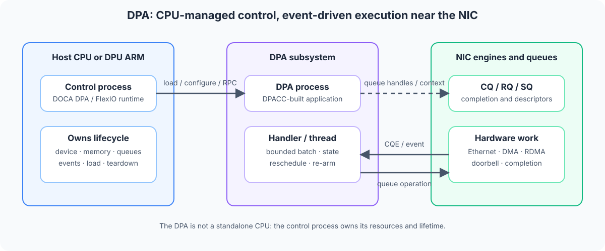
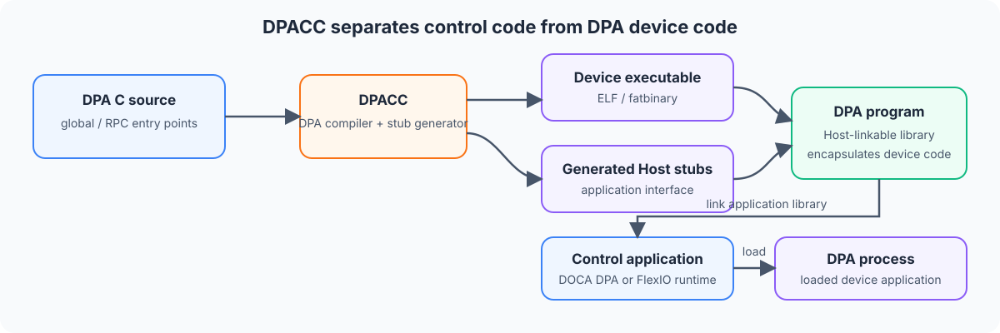

# 21. DPA、FlexIO 与 DPACC 编程模型

## 1. 为什么需要 DPA

前面的章节把执行位置分成 Host CPU、DPU ARM 和硬件 fast path。这个划分还缺少一层：**DPA（Data-path Accelerator）**。

DPA 是 BlueField-3、部分 ConnectX/SuperNIC 及后续受支持平台中的可编程数据路径处理子系统。它靠近 NIC 的队列、completion 和数据移动资源，适合执行通信密集、事件驱动、对时延敏感的短任务。

它解决的问题不是“再提供一颗通用 CPU”，而是：

- 把频繁的队列处理、completion 处理和协议状态推进从 Host CPU/DPU ARM 下沉；
- 在靠近 NIC 数据路径的位置运行用户编写的 C 代码；
- 用事件触发 DPA handler/thread，减少通用 CPU 参与 fast path；
- 在硬件固定功能无法完整表达业务逻辑时，提供受约束的可编程执行层。

官方文档强调：DPA 不能作为独立 CPU 使用。DPA 程序的加载、内存分配、资源创建和生命周期仍由 Host 或 DPU 侧控制进程管理。

官方参考：

- DPA Subsystem：<https://docs.nvidia.com/doca/sdk/DPA-Subsystem/index.html>
- DPA Development：<https://docs.nvidia.com/doca/sdk/DPA-Development/index.html>
- DOCA DPA：<https://docs.nvidia.com/doca/sdk/DOCA-DPA/index.html>
- DOCA DPACC Compiler：<https://docs.nvidia.com/doca/sdk/DOCA-DPACC-Compiler/index.html>

## 2. 四个容易混淆的名词

| 名词 | 所在层 | 作用 | 可以类比为什么 |
|---|---|---|---|
| DPA | 硬件/执行子系统 | 执行靠近 NIC 数据路径的用户代码 | 一类专用、事件驱动的可编程处理器 |
| DOCA DPA | 高层 SDK | 管理 DPA application、执行、同步和通信等对象 | 面向应用开发的 DPA runtime API |
| FlexIO | 低层 SDK/driver API | 管理 DPA process、memory、handler、window、outbox 和硬件队列 | 更接近 NIC 队列和 DPA 执行细节的接口 |
| DPACC | 编译工具链入口 | 编译 DPA device code，并生成 Host 可链接的 DPA program | 类似“设备编译器 + Host stub 生成器” |

三者不是互相替代的同义词：

1. 用 DPACC 编译运行在 DPA 上的代码；
2. 用 DOCA DPA 或 FlexIO 从控制进程加载和驱动这些代码；
3. 代码最终运行在 DPA 硬件子系统上。

DOCA DPA 建立在较高抽象层，适合应用级协议和通信卸载；FlexIO 提供更低层控制，适合必须直接管理 NIC 队列、CQ、outbox、window 或事件 handler 的场景。

## 3. DPA 在系统中的位置



图中最重要的边界是：

- **控制进程**运行在 Host CPU 或 DPU ARM 上；
- **DPA program**运行在 DPA process 中；
- **NIC engine**继续负责收发、DMA、RDMA 和 completion 等硬件工作；
- DPA 通过事件、队列和受控内存访问推进数据路径逻辑。

这里的官方术语 `host` 常指“发起 DPA 控制操作的 CPU 进程”，不一定只指物理服务器 Host CPU；某些部署中控制进程也可以运行在 DPU ARM 上。

## 4. 什么时候应该考虑 DPA

适合 DPA 的工作通常同时满足以下条件：

1. 与网络或 I/O 队列强相关；
2. 事件频繁、单次工作量小；
3. 对 completion 到处理动作之间的时延敏感；
4. 固定硬件 action 无法完整表达，但又不希望回到通用 CPU 慢路径；
5. 状态可以放入受控、紧凑的数据结构中。

典型方向包括：

- 收到 CQE 后快速推进协议状态；
- 通信库或存储协议中的队列处理；
- 基于 RDMA 的自定义数据移动编排；
- DPA Comms / DPA Verbs 等以 DPA 为执行端的通信逻辑；
- 需要靠近 NIC 的轻量 packet/I/O metadata 处理。

不适合直接放到 DPA 的工作：

- 大型控制面、配置解析、REST/gRPC 服务；
- 文件系统访问、复杂系统调用和通用 OS 服务；
- 长时间不让出执行资源的计算；
- 依赖大规模动态内存、复杂 C++ runtime 或通用线程库的逻辑；
- 已经能由 DOCA Flow 等固定硬件 pipeline 完整完成的规则化转发。

选择顺序通常是：

```text
固定硬件 action 能完成？
  ├─ 是：优先 Flow / RDMA / DMA 等硬件 fast path
  └─ 否：是否为高频、短小、NIC 事件驱动逻辑？
       ├─ 是：评估 DPA
       └─ 否：留在 Host CPU 或 DPU ARM
```

## 5. 编译模型：一份应用，两类代码

DPA 应用至少包含两部分：

| 部分 | 编译目标 | 职责 |
|---|---|---|
| Host/control code | Host CPU 或 DPU ARM | 打开设备、检查能力、加载 application、创建资源、触发/停止执行、收集结果 |
| DPA device code | DPA architecture | 定义 kernel、RPC 或 event handler，处理 DPA 内存和 NIC 事件 |

DPACC 接收 DPA C 源文件，调用 DPA 专用编译器生成 device executable，同时生成 Host stub。输出的 DPA program 是 Host 可链接的库，其中封装了 Host 接口和一个或多个目标架构的 device executable。



### 5.1 关键标注

官方工具链使用专用标注区分 DPA 入口，例如：

- `__dpa_global__`：标记在 DPA 上执行的入口/handler，以及需要在 Host 与 DPA 间保持一致布局的相关类型；
- `__dpa_rpc__`：标记由控制侧同步调用、在 DPA 上执行并返回值的 RPC 入口。

具体可用标注和签名随 DOCA/DPACC 版本变化，应以目标 SDK 头文件和随包 sample 为准。

### 5.2 DPACC 输出

常见输出包括：

- DPA object：通常以 `.dpa.o` 表示，包含 device object 和生成的 Host 接口信息；
- DPA program：可链接到控制应用的 Host library，内部封装 device executable；
- DPA library：分开的 Host archive 与 device archive，便于复用；
- fatbinary：可包含多个 DPA 目标架构的 device code。

一个只表达构建关系的示例：

```bash
# 参数和目标名称仅作结构示例，请按已安装 DPACC 的 --help 和官方 sample 调整
dpacc -hostcc=gcc -mcpu=<dpa-target> device.c -o libdevice_app.a

# 控制程序链接 DPACC 产物与所选 runtime
gcc host.c -o dpa_demo libdevice_app.a <doca-dpa-or-flexio-link-flags>
```

不要复制别的机器的 `-mcpu`、库路径和链接参数。DPA 目标架构、Host 架构、DOCA 版本及部署侧必须匹配。

## 6. DOCA DPA 高层对象

不同 DOCA 版本的对象名称和执行 API 会演进，但核心关系稳定：

| 对象 | 作用 | 生命周期要点 |
|---|---|---|
| DOCA device | 表示支持 DPA 的 PF/device | 先查询能力，再打开 |
| DPA application | DPACC 产物在 Host 侧的接口 | 必须与 device code、目标架构匹配 |
| DPA context/process | 封装某设备上的 DPA 执行环境 | 由控制进程拥有；控制进程结束时资源随之释放 |
| Kernel/handler | DPA 上的用户函数 | 应短小、可并发、可被事件驱动 |
| DPA thread / EU affinity | 执行 kernel，并可控制 execution unit 放置 | 数量和放置受硬件能力限制 |
| Completion context | 把 NIC completion 事件关联到 DPA 执行 | 队列所有权和 re-arm 必须清晰 |
| DPA memory | DPA process 的 heap/global/stack | 地址空间与生命周期不能混淆 |
| Sync event | 在 CPU、DPU、GPU、DPA 等位置间传递计数式依赖 | publisher/subscriber 和阈值必须正确 |
| RDMA/communication object | 让 DPA 参与远端通信 | 连接、内存授权和 completion 仍需控制面配置 |

### 6.1 生命周期

一个典型顺序是：

1. 枚举 DOCA device 并检查 DPA capability；
2. 打开适合的 PF/device；
3. 用 DPACC 生成的 application 创建 DPA context/process；
4. 分配 DPA heap，准备要传给 device code 的 context；
5. 创建 sync event、completion context、RDMA 或底层队列资源；
6. 把 device handle、地址和资源编号写入 DPA context；
7. 启动 DPA thread/kernel，或将 handler 绑定到 CQ；
8. 控制面发出开始事件，数据面由 completion 持续驱动；
9. 停止新事件，等待在途工作退出；
10. 按依赖反序销毁资源和 DPA context。

## 7. 两种执行方式

### 7.1 DOCA DPA kernel/thread

高层接口把用户函数表示为 DPA kernel。控制程序创建执行对象、指定线程数或 execution unit affinity，并用 event/completion 建立启动和完成关系。

以下是概念伪代码，不是可直接编译的固定版本 API：

```c
// DPA device code
__dpa_global__ void process_completions(struct dpa_worker_ctx *ctx)
{
    unsigned int rank = dpa_thread_rank();
    struct worker_queue *q = &ctx->queues[rank];

    while (!ctx->stop) {
        if (cq_has_work(q->cq)) {
            handle_bounded_batch(q);
            rearm_or_update_consumer(q);
        }
        yield_or_reschedule();
    }
}
```

```c
// Host/DPU control code
open_dpa_capable_device(&dev);
create_dpa_context(dev, dpacc_generated_app, &dpa);
allocate_and_copy_worker_context(dpa, &worker_ctx);
create_start_and_completion_events(dpa, &start_ev, &done_ev);
launch_dpa_kernel(dpa, start_ev, done_ev, nthreads,
                  process_completions, worker_ctx);
signal_start_from_cpu(start_ev);
wait_for_completion_on_cpu(done_ev);
destroy_resources_in_reverse_order();
```

设计重点不是 API 名称，而是：控制侧拥有资源，DPA 侧只拿已经授权的 handle/address；启动与完成关系通过明确事件表达。

### 7.2 FlexIO event handler 与 RPC

FlexIO 更靠近底层。常见执行方式包括：

- **event handler**：armed CQ 产生 completion 时触发 DPA handler；
- **RPC**：控制侧同步调用一次 DPA 函数，常用于初始化或更新 DPA 内存中的控制状态。

事件 handler 的典型逻辑是：

```text
CQE 到达
  -> DPA event handler 被调度
  -> 拉取有限数量 completion
  -> 更新协议/队列状态
  -> 必要时通过 outbox 提交 send/recv
  -> re-arm CQ
  -> reschedule/yield
```

RPC 更适合控制路径，不应该在每个 packet 或每个 completion 上由 CPU 同步调用。

## 8. 内存模型

DPA 代码可能接触多种内存：

| 内存 | 特征 | 常见用途 |
|---|---|---|
| DPA global | 随 DPA program/process 存在 | 只读表、小型全局状态；避免隐式共享写竞争 |
| DPA stack | execution unit/thread 的临时空间 | 局部变量；不要假设跨 handler 调度后仍保留 |
| DPA heap | process 生命周期内保持 | worker context、队列状态、统计信息 |
| External registered memory | Host/DPU 已注册并通过 window/mkey 映射 | 数据 buffer、共享状态、描述符 |
| NIC queue memory | 由控制侧创建后交给 DPA 使用 | CQ/RQ/SQ、doorbell/outbox 相关数据 |

必须区分三件事：

1. 某个地址对 DPA 是否可见；
2. DPA 是否被授权访问对应 memory key/window；
3. 数据与控制字段的可见顺序是否满足同步语义。

“已经把指针传给 DPA”不等于“DPA 可以安全访问这段内存”。外部内存需要正确注册和映射，且控制进程不能在 handler 仍可能访问时释放它。

FlexIO 的 external memory 访问不是自动 cache coherent。对共享数据的发布和读取必须使用目标 SDK 规定的 memory fence、writeback/invalidate 或同步原语；`volatile` 不能替代设备间一致性协议。

## 9. 并发、同步与完成语义

DPA 面向高度并发执行，但不能照搬 pthread 思维。

### 9.1 每线程资源

优先让每个 DPA thread 拥有独立的：

- CQ consumer state；
- RDMA/queue handle；
- scratch buffer；
- counter shard；
- error/status slot。

共享队列或共享可写结构会引入竞争和原子操作成本。若必须共享，要按官方支持的原语设计，不能假设普通 C 读写天然线程安全。

### 9.2 Sync event

Sync event 是计数式同步对象。设计时要明确：

- publisher 在 CPU、DPU、GPU 还是 DPA；
- subscriber 在哪里；
- `set` 与 `add` 的语义；
- wait threshold 是否可能被旧值提前满足；
- 错误路径是否仍会通知等待方。

### 9.3 Kernel 完成不等于业务完成

DPA kernel/thread 的 completion 只表示该执行对象达到指定完成条件。若它提交了 RDMA write、send 或其他硬件工作，还要确认相应队列 completion 和上层协议语义。

## 10. 能力与环境检查

不要只根据设备型号判断支持情况。先记录：

```bash
/opt/mellanox/doca/tools/doca_caps --list-devs
/opt/mellanox/doca/tools/doca_caps --list-libs | grep -Ei 'dpa|flexio'
/opt/mellanox/doca/tools/doca_caps | grep -i dpa -A 80

dpacc --version
dpacc --help
```

还要核对：

- BlueField/ConnectX 代际是否支持目标 DPA 功能；
- firmware、DOCA runtime、DPACC/toolchain 是否属于兼容组合；
- 控制程序运行在 Host 还是 DPU，设备 PF/VF/SF 选择是否符合该 API 要求；
- DPA execution unit 是否已按部署要求分配；
- DPACC 目标架构与运行设备是否一致；
- 目标功能在当前版本中的 quality level 和 known limitations。

命令路径和选项可能随 DOCA 版本变化，以安装环境与官方 sample 为准。

## 11. 性能设计

### 11.1 保持 handler 有界

每次事件只处理有限 batch，然后 re-arm/yield。无限轮询或一次处理过多工作会让其他 DPA 任务饥饿，并可能触及 kernel 最大运行时间限制。

### 11.2 减少控制侧往返

不要为每个 completion 调一次 Host→DPA RPC。更好的模型是：

- 初始化时一次性创建资源；
- 把稳定配置放入 DPA heap；
- 用 CQ/event 驱动 fast path；
- 配置变化才走 RPC 或 sync event。

### 11.3 数据结构贴近队列

按 queue/thread 分片，避免跨 execution unit 共享热点。把 handler 需要的字段集中放置，避免追逐深层指针和访问不必要的外部内存。

### 11.4 用分层指标证明收益

至少同时比较：

| 指标 | CPU/DPU ARM 处理 | DPA 处理 |
|---|---:|---:|
| completion→动作时延 | baseline | result |
| p50/p99 | baseline | result |
| Host CPU 使用率 | baseline | result |
| DPU ARM 使用率 | baseline | result |
| 吞吐/队列 | baseline | result |
| 错误、重试、drop | baseline | result |

只看到 CPU 降低不能证明系统更快；也要确认尾延迟、队列公平性和失败恢复。

## 12. 常见问题

| 现象 | 可能原因 | 处理 |
|---|---|---|
| DPACC 编译失败 | toolchain、target、Host compiler 或头文件不匹配 | 从当前安装版本的 DPA sample 构建命令开始 |
| application 无法加载 | fatbinary 不含目标架构、runtime/firmware 不兼容 | 检查 DPACC target 和版本矩阵 |
| DPA context 创建失败 | 设备不支持、PF/VF/SF 选错、EU 未配置 | 查 capability 和 DPA 管理配置 |
| handler 从不触发 | CQ 未 armed、completion context 未绑定、事件阈值错误 | 从队列创建到 event 绑定逐层记录 ID |
| 外部内存访问错误 | window/mkey/address/权限不匹配 | 明确注册、映射和销毁顺序 |
| 多线程结果偶发错误 | 共享状态竞争或同一 queue 被多个 thread 操作 | 每线程分片，明确单 owner |
| 运行一段时间后 fatal | handler 不让出、超过运行时间或错误未恢复 | 有界 batch、reschedule，记录 fatal 前最后状态 |
| DPA 更慢 | 工作量过小/过大、RPC 太频繁、外部内存访问多 | 量化控制往返与每事件工作量，重新划分边界 |

## 13. 与现有 DOCA 模块如何组合

| 组合 | 分工 |
|---|---|
| Flow + DPA | Flow 做可表达的分类/转发；需要可编程处理的事件再交给 DPA |
| RDMA + DPA | 控制侧建连和注册内存；DPA 推进通信或处理 completion |
| Comch + DPA Comms | CPU/DPU 控制面下发配置；DPA 参与低时延消息/数据路径 |
| DMA + DPA | 控制侧准备授权和 buffer；DPA 根据事件触发或编排数据移动 |
| Telemetry + DPA | DPA 维护轻量分片 counter；控制侧低频汇总和导出 |

DPA 不是取代这些模块，而是补充“固定硬件引擎”和“通用 CPU 软件”之间的可编程执行层。

## 14. 最小学习路线

建议按以下顺序学习，而不是直接写复杂协议：

1. 跑通当前 DOCA 版本附带的 DPA hello/kernel sample；
2. 确认 DPACC 能为实际设备目标生成并加载 application；
3. 用 CPU→DPA sync event 启动一个短 kernel；
4. 用 DPA→CPU completion event 返回结果；
5. 分配 DPA heap，并传入一个小型 context；
6. 将单个 CQ/completion 绑定到 handler；
7. 加入每线程独立队列和统计；
8. 最后才引入 RDMA、DPA Comms 或 FlexIO 底层队列。

每一步都记录设备 BDF、DOCA/firmware/DPACC 版本、执行线程数、事件数和错误码。

## 15. 学完本章应该记住

1. DPA 是受 Host/DPU 控制进程管理的近数据路径执行子系统，不是独立通用 CPU。
2. DPACC 负责编译 DPA device code 并生成 Host 可链接接口。
3. DOCA DPA 是较高层 SDK；FlexIO 提供更低层的 process、memory、handler 和 NIC queue 控制。
4. DPA fast path 应由 CQ/event 驱动，RPC 主要用于低频控制。
5. 资源、内存授权、queue owner、event publisher/subscriber 和销毁顺序必须显式设计。
6. DPA 是否有价值要用端到端时延、CPU 占用、吞吐和错误恢复共同验证。

## 16. 下一步

继续阅读：[22. DOCA GPUNetIO 与 GPU 直接处理网络包](22-doca-gpunetio-gpu-packet-processing.md)。
