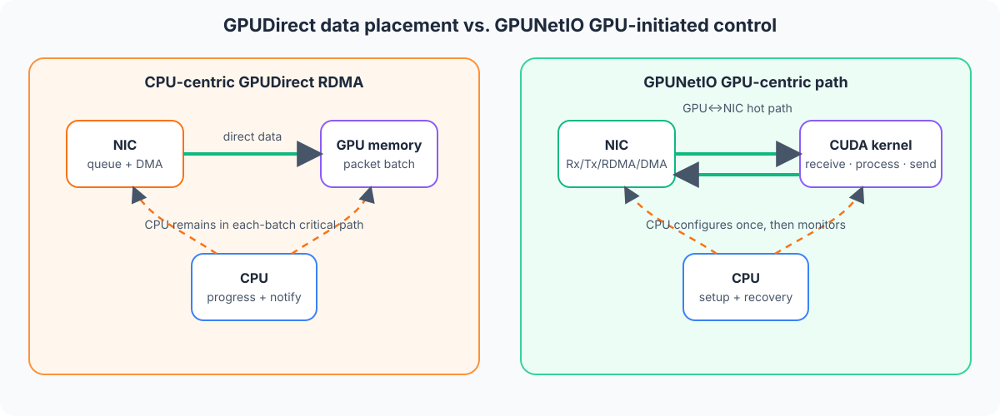
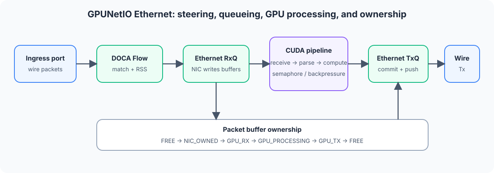

# 22. DOCA GPUNetIO 与 GPU 直接处理网络包

## 1. GPUNetIO 解决什么问题

传统 GPU 网络程序即使使用 GPUDirect RDMA，常常仍是 CPU-centric：

1. CPU 创建和推进 NIC 队列；
2. NIC 把数据直接写入 GPU memory；
3. CPU 观察 completion；
4. CPU 通知或启动 CUDA kernel；
5. GPU 处理数据。

数据没有经过 CPU memory，不代表 CPU 已经离开关键路径。每批数据仍需要 CPU 协调时，CPU 调度、doorbell、同步和通知会带来延迟，并限制扩展性。

DOCA GPUNetIO 提供 GPU-centric 模型：CPU 负责初始化和控制，CUDA kernel 可以直接收发网络数据、推进 RDMA/DMA 等操作，让 CPU 从稳定数据面的关键路径中退出。

官方参考：

- DOCA GPUNetIO：<https://docs.nvidia.com/doca/sdk/DOCA-GPUNetIO/index.html>
- Architecture and Design：<https://docs.nvidia.com/doca/sdk/GPUNetIO-Architecture-and-Design/index.html>
- Installation and Setup：<https://docs.nvidia.com/doca/sdk/GPUNetIO-Installation-and-Setup/index.html>
- API Reference：<https://docs.nvidia.com/doca/sdk/GPUNetIO-API-Reference/index.html>
- GPU Packet Processing Application：<https://docs.nvidia.com/doca/sdk/DOCA-GPU-Packet-Processing-Application-Guide/index.html>

## 2. 先分清四个概念

| 概念 | 解决的问题 | CPU 是否仍在关键路径 |
|---|---|---|
| CUDA kernel | 在 GPU 上并行计算 | 网络控制可能仍由 CPU 完成 |
| GPUDirect RDMA | NIC 与 GPU memory 直接搬数据，避免 CPU staging copy | 可能仍需要 CPU 提交/通知 |
| GDAKI / GPUDirect Async | CUDA kernel 直接控制网络队列/doorbell 等操作 | 稳定数据面可以不需要 CPU |
| DOCA GPUNetIO | 提供 GPU memory、queue export、GPU-side Ethernet/RDMA/DMA/Comch API 和同步对象 | CPU 负责 setup/control，GPU 可负责 hot path |

在 RDMA 语境中，GPU 发起的异步网络控制也常称为 IBGDA。不要把“GPUDirect RDMA”与“GPU 发起网络操作”当成同一件事：前者重点是数据放置路径，后者重点是谁推进队列。

## 3. 系统架构



一个典型 GPUNetIO 应用仍有完整 CPU 控制面：

- 选择 GPU 和 NIC；
- 初始化 CUDA context；
- 创建 DOCA device、GPU、mmap、buffer、Rx/Tx/RDMA/DMA 等对象；
- 配置 DOCA Flow，把目标流量导向 GPU 使用的队列；
- 把 CPU 创建的 DOCA 对象导出为 GPU device handle；
- 启动、监控和停止 CUDA kernel；
- 处理配置更新、错误和资源回收。

GPU 数据面负责：

- 从 Rx queue 取 packet/buffer；
- 在 CUDA kernel 中解析和计算；
- 通过 Tx/RDMA/DMA queue 提交操作；
- 用 semaphore 或共享状态与其他 kernel/CPU 协作；
- 批量 commit/push doorbell。

所以正确表述是“CPU 从稳定数据面的关键路径退出”，不是“应用完全不需要 CPU”。

## 4. 支持的主要数据路径

GPUNetIO 不只是 Ethernet packet API。当前官方接口围绕多类 DOCA 对象提供 GPU handler：

| 数据路径 | CPU 控制侧 | GPU 数据侧 |
|---|---|---|
| Ethernet | 创建 DOCA Ethernet Rx/Tx queue、配置 Flow/RSS | CUDA kernel receive、enqueue、commit、push |
| RDMA | 建立 RDMA/Verbs 资源、注册内存、交换连接信息 | CUDA kernel post receive/send/read/write 并处理 completion |
| DMA | 创建 DMA queue、准备 GPU/可访问内存 | CUDA kernel 发起 BlueField DMA engine copy |
| Comch | 创建 producer/consumer 并导出 GPU handle | CUDA kernel 收发控制/数据消息 |
| Semaphore | CPU 创建、配置 item 和内存类型 | kernel↔kernel 或 CPU↔kernel 的低延迟状态传递 |

能力取决于 NIC/BlueField、GPU、firmware、driver、DOCA 和 CUDA 的具体组合。必须从目标版本的 compatibility matrix、capability 和 sample 验证，不能根据 API 名称推断所有平台都支持。

## 5. CPU API 与 GPU API

GPUNetIO 的接口天然分成两侧：

### 5.1 CPU 侧

CPU 侧通常使用普通 DOCA/CUDA API：

- `doca_gpu_create()`：创建指定 GPU 的 GPUNetIO handle；
- `doca_gpu_mem_alloc()`：按指定可见性分配 GPU/CPU-GPU memory；
- `doca_gpu_semaphore_create()`：创建跨执行实体的 semaphore；
- DOCA Core/Ethernet/RDMA/DMA API：创建控制侧对象；
- 各模块的 GPU export API：得到 CUDA kernel 可使用的 device handle。

### 5.2 GPU 侧

GPU 侧接口位于 `.cuh` 头文件，由 CUDA kernel 调用，例如：

- Ethernet Rx/Tx queue；
- Verbs/RDMA queue；
- DMA queue；
- buffer array；
- semaphore；
- Comch producer/consumer。

CPU handle 和 GPU device handle 不是可互换的裸指针。CPU 创建、配置并导出对象，CUDA kernel 只使用对应 GPU handle。

## 6. 内存模型

GPUNetIO 的内存类型名称表达“内存在哪里、谁能访问”：

| 类型 | 内存位置 | 可访问者 | 典型用途 |
|---|---|---|---|
| `DOCA_GPU_MEM_TYPE_GPU` | GPU | GPU | packet buffer、GPU-only 工作区 |
| `DOCA_GPU_MEM_TYPE_GPU_CPU` | GPU | GPU + CPU | CPU 低频读取 GPU 结果、退出标志或共享 semaphore |
| `DOCA_GPU_MEM_TYPE_CPU_GPU` | CPU pinned/shared | CPU + GPU | 无 GPUDirect RDMA 平台或 CPU proxy 场景 |

`doca_gpu_mem_alloc()` 可能返回两个不同地址：

- `memptr_gpu` 只能在 CUDA kernel/GPU 侧使用；
- `memptr_cpu` 只能在 CPU 侧使用。

即使它们描述同一块可共享内存，也不能把 GPU virtual address 拿到 CPU 解引用，否则可能直接 segmentation fault。

### 6.1 NIC 如何访问 GPU memory

NIC 要把 packet 直接写入 GPU memory，必须注册并建立 DMA mapping。当前官方推荐优先使用 `dmabuf`，不可用时可回退到 `nvidia-peermem`。

典型关系是：

```text
doca_gpu_mem_alloc
  -> 获取 GPU buffer
  -> 尝试获取 dmabuf fd
  -> doca_mmap 设置 dmabuf memory range
  -> 若不可用，设置普通 memory range 并由环境回退到 nvidia-peermem
  -> 将 mmap 绑定 NIC/DOCA device
  -> start mmap
```

具体驱动模式、kernel/CUDA/libibverbs 要求随版本变化。以目标版本的 GPUNetIO Installation and Setup 为准。

### 6.2 Semaphore

GPUNetIO semaphore 是由多个 item 组成的状态交换结构。典型 producer/consumer 约定：

```text
producer:
  填充 packet index / count / custom info
  -> 发布 READY

consumer:
  等待 READY
  -> 读取并处理
  -> 发布 DONE/FREE
```

它适合：

- receive kernel 把 packet batch 交给 compute kernel；
- GPU 将统计摘要低频交给 CPU；
- CPU 设置 stop/config generation，GPU 轮询更新；
- 多级 CUDA pipeline 实现有界 backpressure。

状态发布前后必须遵守 API 规定的 memory ordering，不能只靠普通字段写入顺序碰运气。

## 7. Ethernet 收包与发包模型

一个常见 packet pipeline 是：



### 7.1 收包

1. CPU 创建多个 Ethernet Rx queue；
2. CPU 用 DOCA Flow/RSS 将 UDP、TCP、ICMP 或特定 5-tuple 导向这些 queue；
3. Rx queue 将 packet 放入已映射的 GPU buffer；
4. CUDA warp/block 批量 receive；
5. kernel 解析 header、更新统计或进入后续计算。

100Gb/s 及以上流量通常不应只依赖单个 Rx queue。应按流量和 GPU 并行度建立多 queue，并验证 RSS 分布是否均衡。

### 7.2 发包

1. kernel 准备或修改 packet；
2. 一个明确的 thread/warp/block owner 向 Tx queue enqueue；
3. 批量 commit；
4. push/ring doorbell；
5. 根据 queue completion 或 buffer ownership 规则回收 buffer。

高层 Ethernet API 支持 thread、warp 或 block execution scope。官方建议优先选择可行的更宽 scope（warp/block），减少原子竞争和 doorbell 开销。实际选择要与 queue 数量、packet batch 和 kernel 布局一起测量。

### 7.3 GPU doorbell 与 CPU proxy

GPU 可以直接 ring NIC doorbell，也可以选择 CPU proxy：GPU 写入提交信息，由 CPU proxy thread 代为 ring doorbell。

CPU proxy 适合硬件或拓扑不支持完整 GPU-initiated 路径的情况，但 CPU 会重新进入发送推进路径。此时必须把 proxy CPU 使用率和延迟计入结果，不能宣称是完全 GPU-centric。

## 8. RDMA、DMA 与 GPU 数据路径

### 8.1 GPUNetIO RDMA

控制侧仍负责：

- 选择 device/port/GID；
- 创建 RDMA/Verbs 对象和 queue；
- 注册 GPU memory；
- 与远端交换连接和 memory descriptor；
- 把对象导出成 GPU handler。

CUDA kernel 可以负责：

- post receive；
- send/write/read 等操作；
- commit/push；
- poll completion；
- 根据计算结果继续下一次网络操作。

这让“收到数据 → GPU 计算 → 发出结果”的循环不必逐批回到 CPU。

### 8.2 GPUNetIO DMA

GPU kernel 可以通过 GPUNetIO 驱动 BlueField DMA engine 完成授权内存间的数据移动。它不是 CUDA core 自己执行逐字节 copy，也不是所有 CUDA `memcpy` 的通用替代品。

选择前要问：

- 源/目标内存是否能被 DMA engine 访问；
- copy 大小和 batch 是否足以摊薄 queue 提交成本；
- DMA completion 如何与 CUDA kernel 同步；
- 是否真的减少 copy，还是增加了一次额外搬运。

## 9. 最小应用生命周期

下面是结构伪代码，表达 CPU/GPU 分工，不保证对应某个 DOCA 版本的精确函数签名：

```c
// CPU control path
cudaSetDevice(cuda_id);
cudaFree(0);                         // 确保 CUDA context 已初始化

open_doca_nic(nic_bdf, &dev);
doca_gpu_create(gpu_bdf, &gpu);

doca_gpu_mem_alloc(gpu, packet_bytes, alignment,
                   DOCA_GPU_MEM_TYPE_GPU,
                   &packet_mem_gpu, NULL);
register_gpu_memory_for_nic(dev, gpu, packet_mem_gpu, &mmap);

create_eth_rx_tx_queues(dev, mmap, &rxq, &txq);
export_queues_to_gpu(rxq, txq, &rxq_gpu, &txq_gpu);
create_flow_rules_to_rxq(dev, rxq);

launch_packet_kernel(rxq_gpu, txq_gpu, packet_mem_gpu, stop_flag_gpu);
monitor_control_plane_and_stats();

set_stop_flag_from_cpu();
cudaDeviceSynchronize();
stop_flow_and_queues();
destroy_resources_in_reverse_order();
```

```cuda
// GPU data path
__global__ void packet_loop(gpu_rxq_t *rxq,
                            gpu_txq_t *txq,
                            bool *stop)
{
    while (!*stop) {
        packet_batch batch;

        if (!receive_batch_warp(rxq, &batch))
            continue;

        for_each_packet_in_warp(batch) {
            parse_headers();
            classify_or_compute();
            prepare_forward_or_reply();
        }

        enqueue_batch(txq, batch);
        commit_and_push(txq);
        release_or_recycle(batch);
    }
}
```

真实代码必须增加 error path、queue capacity、timeout、shutdown handshake、memory ordering 和在途 buffer 回收。

## 10. 环境与拓扑检查

### 10.1 基本信息

```bash
nvidia-smi
nvidia-smi topo -m
nvidia-smi -q | grep -i bar -A 3

lspci -nn | grep -Ei 'NVIDIA|Mellanox'
ibv_devinfo

/opt/mellanox/doca/tools/doca_caps --list-devs
/opt/mellanox/doca/tools/doca_caps --list-libs | grep -Ei 'gpu|ethernet|rdma|dma'
```

记录 GPU BDF、NIC BDF、NUMA node、NIC port、netdev、RDMA device、DOCA/CUDA/driver/firmware 版本。

### 10.2 PCIe 拓扑

`nvidia-smi topo -m` 中：

- `PIX`：至多经过一个 PCIe bridge，通常最理想；
- `PXB`：经过多个 PCIe bridge，但不经过 Host bridge，通常也适合；
- `PHB`：经过同一 PCIe Host bridge，可工作但要实测；
- `NODE` / `SYS`：经过 Host bridge/NUMA 或 CPU interconnect，通常会降低 NIC↔GPU 吞吐并增加延迟。

拓扑不是软件优化能完全补救的。发现 NIC 与 GPU 跨 NUMA/SYS 时，应先重新选择 GPU/NIC 对或调整插槽，再分析 kernel。

### 10.3 BAR1 与 memory mapping

如果 GPU BAR1 太小，GPU memory 注册或 DOCA mmap start 可能失败。检查 BIOS 是否支持 Resizable BAR，并以平台官方配置指南为准。

若 `dmabuf` 失败：

1. 检查是否使用支持 dmabuf 的 NVIDIA open kernel driver；
2. 检查 kernel、CUDA 和 libibverbs 版本要求；
3. 检查 `nvidia-peermem` fallback 是否已安装和加载；
4. 查看完整 DOCA mmap 错误，而不是只捕获最后一个返回码。

## 11. Flow、queue 与 packet ownership

GPUNetIO Ethernet 应用不是“创建 CUDA kernel 就能收到网卡所有流量”。必须建立完整 steering：

```text
physical port / representor
  -> DOCA Flow match
  -> RSS / queue selection
  -> Ethernet Rx queue
  -> GPU buffer
  -> CUDA kernel
```

排障时分别证明：

1. packet 到达物理 port；
2. Flow entry counter 命中；
3. RSS 将流量送到预期 queue；
4. queue producer index 前进；
5. CUDA kernel 观察到 packet；
6. buffer 被正确归还，queue 没有耗尽。

packet buffer 必须有明确 owner，例如：

```text
FREE -> NIC_OWNED -> GPU_RX -> GPU_PROCESSING -> GPU_TX -> FREE
```

如果处理 kernel 比 receive kernel 慢，semaphore/ring 必须有容量上限和 drop/backpressure 策略，不能无限覆盖未消费 item。

## 12. CUDA 执行与内存一致性

### 12.1 Persistent kernel

GPUNetIO 常使用长驻 kernel 轮询 queue，以避免 CPU 每批 launch。需要避免：

- 空轮询占满所有 SM，影响真正的 compute kernel；
- 单个 queue owner 阻塞整个 block；
- shutdown flag 不可见导致无法退出；
- 错误后仍无限循环。

可以限制用于网络 kernel 的 block/SM 资源，并把 receive、compute、transmit 通过有界 queue 解耦。

### 12.2 NIC write 与 GPU visibility

NIC 经 PCIe 写入 GPU memory 后，CUDA kernel 何时能安全看到完整 packet 受平台和 GPU 架构的 memory consistency 要求约束。GPUNetIO 对需要的平台提供 MCST 配置/模式。

不要自行用一个普通 `volatile` 标志替代官方 receive API 的 ordering 语义。尤其在 pre-Hopper GPU 上，应按目标版本文档启用所需 MCST 配置。

### 12.3 Strong/weak 与 commit

部分 GPU queue API 提供不同 ordering/一致性强度以及 enqueue→commit→push 分阶段接口。选择较弱语义前必须证明：

- 同一 queue 只有规定的 owner；
- packet descriptor 和 payload 写入顺序正确；
- commit 数量与实际 enqueue 数量一致；
- 后续操作不会提前观察未完成数据。

## 13. 性能验证

### 13.1 不要只测 GPU kernel 时间

至少采集：

| 层 | 指标 |
|---|---|
| Traffic generator | offered pps/Gbps、packet size、flow 数 |
| NIC/Flow | Rx/Tx/drop、Flow counter、queue 分布 |
| PCIe | NIC↔GPU 实际带宽、拓扑、replay/error |
| GPU network kernel | receive batch、empty poll、queue depth、doorbell 次数 |
| GPU compute | SM occupancy、memory bandwidth、kernel overlap |
| CPU control/proxy | CPU 使用率、proxy loop、配置和异常处理时延 |
| End-to-end | p50/p99/p999、吞吐、loss、结果正确性 |

### 13.2 建立三组 baseline

建议至少比较：

1. CPU staging copy：NIC→CPU memory→GPU；
2. CPU-centric GPUDirect RDMA：NIC→GPU memory，但 CPU 推进；
3. GPUNetIO GPU-centric：NIC→GPU memory，CUDA kernel 推进。

这样才能区分收益来自“去掉 copy”还是“去掉 CPU critical path”。

### 13.3 常见调优方向

- 选择 PCIe 拓扑更近的 GPU/NIC；
- release build，避免用 debug build 做吞吐结论；
- 增加 Rx queue 并验证 RSS 均衡；
- 使用 warp/block scope 和批量 commit；
- 减少 doorbell 次数；
- 网络 kernel 与 compute kernel 使用独立 stream/资源预算；
- semaphore item 与 packet metadata 紧凑布局；
- CPU 只低频汇总统计，不逐 packet 读取 GPU memory。

## 14. 常见问题

| 现象 | 可能原因 | 处理 |
|---|---|---|
| `doca_gpu_create` 失败 | CUDA context 未初始化、GPU BDF 错、版本不兼容 | 先 `cudaFree(0)`，记录 GPU BDF 和版本 |
| GPU mmap start 失败 | dmabuf/peermem、BAR1、driver 或权限问题 | 查 mapping 路径、BAR1 和完整日志 |
| kernel 收不到包 | Flow 未命中、RSS/queue 绑定错误、queue 未启动 | 从 port counter 到 GPU queue 逐层验证 |
| 只收一会儿就停 | buffer 没归还、semaphore 未置回 DONE/FREE、queue 满 | 画 buffer ownership 状态机 |
| 发包无响应 | 没 commit/push、doorbell mode 错、CPU proxy 未 progress | 检查 queue owner 和 proxy loop |
| 吞吐低且 CPU 高 | 实际走 CPU proxy 或 CPU 每批同步 | 采集 proxy/launch 次数，确认关键路径 |
| NIC↔GPU 带宽低 | `NODE`/`SYS` 拓扑、NUMA 不匹配 | 换 GPU/NIC 对或调整插槽/绑核 |
| packet 内容偶发损坏 | memory ordering/MCST、buffer 提前复用 | 使用官方 receive/MCST 语义并延后回收 |
| 多 queue 反而变慢 | RSS 不均、SM/queue 过量、共享 Tx 竞争 | 逐步增加 queue，按 queue 分配 owner |
| ping 能通但不是 GPU 回复 | OS network stack 回了 ICMP | 用不同 TTL/统计、Flow counter 和 kernel counter 证明路径 |

## 15. 安全与生产化边界

- Ethernet sample/application 通常依赖 DOCA Flow，当前官方说明要求 root/sudo；不要为了方便长期以无限权限运行自定义控制服务。
- GPU 与 NIC 的 DMA mapping 扩大了设备可访问内存范围，只注册必需 buffer，并在 teardown 前停止所有 queue。
- packet parser 必须对长度、header offset、fragment 和畸形包做边界检查；GPU 并行不减少输入验证责任。
- 控制面要限制 Flow rule、queue 和 GPU memory 配额，避免单租户耗尽硬件资源。
- watchdog 要能检测 persistent kernel、queue 和 CPU proxy 是否失去进展。
- 升级 driver/firmware/DOCA/CUDA 后重新验证 dmabuf、memory consistency 和性能，不沿用旧结论。

## 16. 最小学习路线

1. 用 `nvidia-smi topo -m` 选择合适的 GPU/NIC 对；
2. 跑通当前 DOCA 版本的 GPUNetIO simple receive sample；
3. 用 Flow counter 和 GPU counter 证明 packet 真正到达 CUDA kernel；
4. 跑通 simple send，并理解 commit/push/doorbell；
5. 加入 GPU semaphore，把 receive 与 process kernel 解耦；
6. 增加多 Rx queue/RSS，测试小包和大包；
7. 再尝试 RDMA 或 DMA GPU-initiated path；
8. 最后与 CPU staging、CPU-centric GPUDirect baseline 做对照。

不要一开始就加入 AI inference。先证明 network path、buffer ownership 和 backpressure 正确，再把 compute kernel 接入。

## 17. 学完本章应该记住

1. GPUDirect RDMA 去掉 CPU staging copy；GPUNetIO/GDAKI 进一步让 GPU 推进数据面队列。
2. CPU 仍负责初始化、steering、资源管理、监控和恢复，只是不必逐批参与 hot path。
3. GPUNetIO 把 CPU 创建的 Ethernet/RDMA/DMA/Comch 对象导出为 CUDA kernel 可用的 GPU handle。
4. GPU/CPU 指针、dmabuf/peermem mapping、BAR1、PCIe topology 和 memory consistency 都是正确性前提。
5. queue、semaphore 和 packet buffer 必须有单一 owner、容量边界和明确状态机。
6. 是否真正受益要通过三组 baseline 和端到端指标验证。

## 18. 下一步

- 回看 [05. DOCA Flow 网络数据面](05-doca-flow-network-datapath.md)，理解 packet 如何进入 GPU queue；
- 回看 [08. DOCA RDMA 与 RoCE](08-doca-rdma-and-roce.md)，理解连接、内存授权和 completion；
- 使用 [13. 性能调优与开发排障手册](13-performance-tuning-and-troubleshooting.md) 设计分层观测；
- 在真实 GPU + NIC/BlueField 环境中优先运行当前 DOCA SDK 随包 sample。
